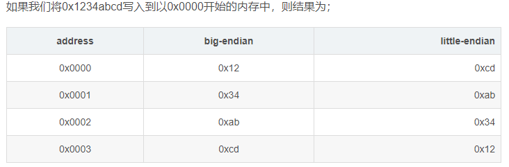

### 概念

数，是一个抽象的概念，是人类用来表示数量的一个智力产物。

位值制记数法：是指按位值制来计数的方法，即一个数的大小，用一组有顺序的数字来表示，每个数字所表示的大小，既取决于它本身的数值；又取决于它所在的位置。

计算机为啥用二进制：计算机的基层部件是由集成电路组成的，集成电路通电时，于是每个输出端就有了电压，电压的高低通过模数转换即转换成了二进制：高电平是由1表示，低电平由0表示。

二进制，十进制，十六进制，八进制的共同点：基数。radix。

八进制：C语言中，加“0”做前缀。如047。

十六进制：从C语言衍生的都用前缀“0x”表示。如0xAF

### 进制转换

二进制转换为十进制，方法：**按权相加法**，即将二进制每位上的数乘以权 [( 位值 \* 基数位次幂 (从0开始)]，然后相加之和即是十进制数

十进制转其它的计算规则：除基数取余法。（或者熟记2的10次幂之内的结果，然后判断，如114=64+32+16+2）

- **整数部分采用除2倒取余法**，具体做法：用2去除十进制整数，可以得到一个商和余数；在用2去除商，又会得到一个商和余数，如此进行，知道商为0时为止，然后把先的到的余数作为二进制的低位有效位，后得到的余数作为二进制数的高位有效位，依次排列起来。
- **小数部分采用乘2取整法**，具体做法：用2乘十进制小数，可以得到积，将积中的整数部分取出，在用2乘余下的小数部分，又得到一个积，在将积中的整数部分取出，如此进行，直到积中的小数部分为0，此时0或1为二进制的最后一位，或者达到所要求的精度为止，然后把取出的整数部分按顺序排列起来，先取得整数作为二进制小数的最高位有效位，后取的整数作为低位有效位。

二进制转八进制：整数部份从最低有效位开始，以3位一组，最高有效位不足3位时以0补齐。小数部分从最高有效位开始，不足补0.

（11001111.01111）2 = （011 001 111.011 110）2 = （317.36）8

八进制转二进制：每一位八进制数改写成等值的3位2进制数，次序不变。

（17.36）8 = （001 111 .011 110）2 = （1111.01111）2

十六进制转二进制：每一位十六进制数改写成等值的4位2进制数，次序不变。

（1CA）16 = （111001010）2

### 原码，反码，补码

根据冯~诺依曼提出的经典计算机体系结构框架。一台计算机由运算器，控制器，存储器，输入和输出设备组成。其中运算器，只有加法运算器，没有减法运算器（据说一开始是有的，后来由于减法器硬件开销太大，被废了 ），所以，计算机中的减法是通过加法来实现的。

1. `而且从硬件的角度上看，只有正数加负数才算减法。`
2. `正数与正数相加，负数与负数相加，其实都可以通过加法器直接相加。`

原码，反码，补码的产生过程，就是为了解决，计算机做减法和引入符号位（正号和负号）的问题。

#### 原码

是最简单的机器数表示法。用最高位表示符号位，‘1’表示负号，‘0’表示正号。其他位存放该数的二进制的绝对值。


正数之间的加法就是一个很简单的二进制加法。而**正数与负数相加**，就要引起莫名其妙的结果，这都是该死的符号位引起的。0分为`+0`和`-0`也是因他而起。

1. 0001+0010=0011 （1+2=3）**OK**
2. 0000+1000=1000 （+0+（-0）=-0）**OK**
3. 0001+1001=1010 （1+（-1）=-2）**Error**

所以原码，虽然直观易懂，易于正值转换。但用来实现加减法的话，运算规则总归是太复杂。于是反码来了。

#### **反码**

1. 正数的反码还是等于原码。
2. 负数的反码就是他的原码除符号位外，按位取反。


原码最大的问题就在于一个数加上他的相反数不等于零。而用反码的方式解决一下原码的问题。

```
# 正数与负数相加，互为相反数相加等于0，解决。虽然是得到的结果是1111也就是-0
0001+1110=1111 （1+（-1）= - 0）

# 两个负数相加，不过好像问题不大，因为1011（是-4的反码，但是从原码来看，他其实是-3。）
1110（-1）+1101（-2）=1011（-4）

1110（-1）+1100（-3）=1010（-5）
```

我们的目的是解决做减法的问题，把减法当成加法来算。

> 两个正数相加和两个负数相加，其实都是一个加法问题，只是有无符号位罢了。而正数+负数才是真正的减法问题。也就是说只要正数+负数不会出错，那么就没问题了。负数加负数出错没关系的，负数的本质就是正数加上一个符号位而已。

- 在原码表示法中两个负数相加，其实在不溢出的情况下结果就只有符号位出错而已`（1001+1010=0011）`
- 反码的负数相加出错，其实问题不大。我们只需要加实现两个负数加法时，将两个负数反码包括符号位全部按位取反相加，然后再给他的**符号位强行置‘1’**就可以了。
- 所以反码表示法其实已经解决了减法的问题，他不仅不会像原码那样出现两个相反数相加不为零的情况，而且对于任意的一个正数加负数，如：`0001（1）+1101（-2）=1110（-1）` 计算值都用反码表示，计算结果是正确的。所以反码与原码比较，最大的优点，**就在于解决了减法的问题。**

但是我们还是不满足为什么 `0001+1110=1111 （1+（-1）=-0）` 为什么是`-0`呢。虽然说反码还有两个负数相加的问题。

#### **补码**

1. 第一种算法
   1. 正数的补码等于他的原码
   2. 负数的补码等于反码+1。
2. 第二种算法：
   1. 《计算机组成原理中》，用‘模’和‘同余’的概念，严谨地解释补码。它的存在，告诉我们忘记那句‘补码=反码+1’，它并不是必须的。
   2. 负数的补码等于他的原码自低位向高位，尾数的第一个‘1’及其右边的‘0’保持不变，左边的各位按位取反，符号位不变。

**为什么补码等于反码加1，为什么自低位向高位取反**?

其实上面那两段话，都只是补码的求法，而不是补码的定义。很多人以为求补码就要先求反码，其实并不是。只不过是补码正好就等于反码加1罢了。

**补码的思想**

**其实就来自于生活。时钟，经纬度，《易经》里的八卦。**补码的思想其实就类似于生活中的时钟。

1. 如果说现在时针现在停在10点钟，那么什么时候时针会停在八点钟呢？
2. 简单，过去隔两个小时的时候，是八点钟。未来过十个小时的时候也是八点钟
3. 也就是说时间正拨10小时，或是倒拨2小时都是八点钟。
4. 也就是10-2=8，而且 10+10=8（10+10=10+2+8=12+8=8）
5. 这个时候满12说明时针在走第二圈了，又走了8小时，所以时针正好又停在八点钟。
6. 所以12在时钟运算中，称之为模，超过了12就会重新从1开始算了。
7. 也就是说， 10-2和10+10从另一个角度来看是等效的，它都使时针指向了八点钟。
8. 既然是等效的，那在时钟运算中，减去一个数，其实就相当于加上另外一个数（这个数与减数相加正好等于12，也称为同余数）
9. 这就是补码所谓模运算思想的生活例子

在这里，我们再次**强调原码，反码，补码的引入是为了解决做减法的问题**。在原码，反码表示法中，我们把减法化为加法的思维是减去一个数，等于加上一个数的相反数，结果发现引入了符号位，却因为符号位造成了各种意向不到的问题。

但是从上面的例子中，我们可以看到其实减去一个数，**对于数值有限制，有溢出的运算（模运算）来说，其实也相当于加上这个数的同余数**，也就是说，我们不引入负数的概念，就可以把减法当成加法来算。

所以接下来我们聊4位二进制数的运算，也不必急于引入符号位。因为补码的思想，把减法当成加法时并不是必须要引入符号位的。而且我们可以通过下面的例子，也许能回答另一个问题，**为什么负数的符号位是‘1’，而不是正数的符号位是‘1’。**

**补码的实例**

接下来我们就做一做四位二进制数的减法吧（先不引入符号位）

> 0110（6）-0010（2）【6-2=4，但是由于计算机中没有减法器，我们没法算】

这个时候，我们想想时钟运算中，减去一个数，是可以等同于加上另外一个正数（同余数）

> 那么这个数是什么呢？从时钟运算中我们可以看出这个数与减数相加正好等于模。

那么四位二进制数的模是多少呢？也就是说四位二进制数最大容量是多少？`其实就是2^4=16=10000B`

> 那么2的同余数，就等于10000-0010=1110（14）

既然如此

0110（6）-0010（2）=0110（6）+1110（14)=10100（20=16+4）

OK，我们看到按照这种算法得出的结果是`10100`，但是对于四位二进制数，最大只能存放4位（硬件决定了），如果我们低四位，正好是`0100（4）`，正好是我们想要的结果，至于最高位的`‘1’`，计算机会把他放入`psw寄存器进位位中。`8位机则会放在`cy`中，x86会放在`cf`中（这个我们不作讨论）

这个时候，我们再想想在四位二进制数中，减去2，就相当于加上它的同余数14（至于它们为什么同余，还是建议看《计算机组成原理》）

> 但是减去`2`，从另外一个角度来说，也是加上`（-2）`。即加上`（-2）`和加上`14`其实得到的二进制结果除了进位位，结果是一样的。
>
> 如果我们把`1110（14）`的最高位看作符号位后就是`（-2）`的补码，这可能也是为什么负数的符号位是`‘1’`而不是`‘0’`，

而且在有符号位的四位二进制数中，能表示的只有`‘-8~7’`，而无符号位数`（14）`的作用和有符号数`（-2）`的作用效果其实是一样的。

那正数的补码呢？加上一个正数，加法器就直接可以实现。所以它的补码就还是它本身。

**下图给出带符号位四位二进制的补码表示法**


到这里，我们发现原码，反码的问题，补码基本解决了。

> 在补码中也不存在负零了，`因为1000表示-8`

这是因为根据上面的补码图，做减法时，`0001（1）+1111（-1）=0000`
我们再也不需要一个`1000`来表示`负0`了，就把它规定为`-8`

负数与负数相加的问题也解决了`1111（-1）+1110（-2）=1101(-3)`

可能说得有点绕，但是实在是没办法。其实我觉得补码还可以这样画。


很优美有没有，如果你想想地理课本，0不就相当于本初子午线，-8不就是180°，而正数相当于西经，负数相当于东经。

**为何这样求补码**

然后我们再来看看为什么负数的补码的求法为什么是反码+1

因为负数的反码加上这个负数的绝对值正好等于1111，再加1，就是1000，也就是四位二进数的模

而负数的补码是它的绝对值的同余数，可以通过模减去负数的绝对值，得到他的补码。

所以 负数的补码就是它的反码+1。

有点绕吧，只能说很难算清楚，你们还是自己算算吧。还有上面我提到的另外一种算法。

接下来，我要说一下我自己算补码的小技巧。

看上面那个图。

> 如果我们把-8当成负数的原点。那么-5的补码是多少呢？

```diff
-5=-8+3
```

-5的补码就是-8的补码加3

```undefined
1000（-8） +0011（3）=1011(-5)
```

所以完全可以口算出`-5的补码是1011`

当然，也可以记住`-1的补码是1111`口算减法得出

对于八位加法器的话，可以把`-128`当补码原点。十六位可以把`-32768`当补码原点。

是的，`128`是`256`（八位二进制数的模）的一半，`32768`是`65536`（十六位二进数的模）的一半

也很方便有没有，而且简单的是

> 补码原点总是最高位是`‘1’`，其他位是`‘0’`

所以做加法总是简单得可以口算。

### 二进制0和二进制负数

正整数的反码和原码为什么相同：

1. 在计算机中，只用补码表示负数，正数用原码表示。
2. 补码和反码被设计出来就是为了表示负数的。

为什么负数使用补码表示：

1. 这样就实现正数加负数的运算，减法可以当作加法运算。（CPU没有减法器）
2. 0的表述实现统一。0的原码和补码都是00000000
   1. 若用原码表示：0的表述为0000 0000和1000 0000.
   2. 用补码表示：0的反码为 1111 1111，补码再加1，进位1 0000 0000，最高第九位，但是计算为8位，所以第九位砍掉，称为溢出。补码为：0000 0000.
   3. 5+（-3）=0000 0101+ 1111 1101= 1 0000 0010=1溢出=0000 0010. =2.

-128的二进制补码是怎么得来的：

1. 补码10000000唯一的表示-128是一个规定
2. -128的原码 10000000 (-128，进位被舍去)
3. -128的反码 11111111
4. -128的补码  加1后，10000000，因为计算时，当进到第8位的时候,就表示溢出了,会被舍弃，叫溢出。

详细说明：

1. 原码、反码和补码是计算机中对数字二进制的三种表示方法，**表示带符号的数**（最高位，1代表负数，0代表正数）。原码：带符号整数，反码：对它的原码（除符号位外）各位取反，补码：对它的原码（除符号位外）各位取反后加1。
2. 无符号的正整数（含0），可以表达0-255，即 2^8=256，一共256种状态，从全0到全1的各种排列组合。
3. 带符号的数，**符号位在内存中存放的最左边一位，为0，则该数为正；若为1，则该数为负。**因此其绝对值最大范围为0-127，即2^7=128，一共正负各128种状态，如果不采用特殊处理，这时候0占用2个编码（10000000和00000000），数据表示范围为-127到-0及+0到127，这样总体上一个字节只有255种状态，0浪费一个状态。
4. 原码+反码：8位**原码和反码**能够表示数的范围是-127~127，255个。
5. 补码：在补码中用(-128)代替了(-0)，所以补码的表示范围为：(-128~0~127)共256个


**对于有符号数而言：**

1. 正数的原码、反码、补码都一样；
2. 负数的反码 = 它的原码符号位不变，其他位取反（0 换成 1 、 1 换成 0 ）；
3. 负数的补码 = 它的反码 +1；
4. 0的反码、补码都是0；

**【特别注意】**

1. 在计算机运算的时候，都是以 补码 的方式来运算的 ，负数要取补码的值。

2. 二进制 转为 十进制，必须使用 二进制 的原码进行转换 。

3. 十进制负数转二进制：先求对应正数，然后符号位改为1，其余位取反加1

   -17=00010001=10010001=11101110=11101111.

4. 二进制负数转十进制：符号位不变，余位取反加1.

结论：

1. 原码范围：－127～－0，＋0～＋127，256种状态
2. 反码范围：－127～－0，＋0～＋127，256种状态
3. 补码范围：－128～－1，＋0～＋127，256种状态，因为[－0]补码和[＋0]补码相同，在补码中－128代替了－0。也可认为是一种规定，这样可都是256种状态。
4. 要注意：(-128)没有相对应的原码和反码, (-128) = (10000000)

### 二进制数间的逻辑运算

7种位运算 bitwise：

1. & 与:  遇0则0

2. | 或：遇1则1

3. ! 非：1-0，0-1

4. ^ 异或：相同为0，相异为1.（不进位加法）。

5. > > 右移：补符号位。（当前符号位为1补1，为0补0)，首位。

6. <<左移：补0. 末尾

7. > > > 无符号右移：补0. 首位。

移位运算与乘除运算的关系：

- 二进制正整数：左移一位，结果是将该数乘以2，右移一位除以2.
- 例：2的3次方：2<<2。
- 例：a=3,b=4. 交换位置。
  - a=a+b;  b=a-b; a=a-b.
  - a=a^b;  b=a^b;  a=a^b. （找出二进制数之间的不相同位数，然后各自取反）。
  - 第一次：a为差异值，它找到了原来a和b的二进制数不相同的位数，1为不相同，0为相同
  - 第二次：左边的a,如果位数为0，表示原值a和b的这个位数是一样的,那么b的这个位数就不需要改；如果位数为1，表示不相同，b的这个位数需要取反。
  - 第三次：同第二步。

x & (x-1)。其作用是将x的二进制表示中右边第一个1置0。

- 例用O(1)时间检测整数n是否是2的幂次。
  - 普通解法：循环除以2 ,是否能除尽得1。while x%2==0   x=x/2;
  - N如果是2的幂次，则N满足两个条件。1.N>0；2.N的二进制表示中只有一个1。
  - 使用x & (x-1)消去1，结果为0，则是2的次幂。
- 例：计算在一个 32 位的整数的二进制表示中有多少个 1.。
- 例：将整数A转换为B，需要改变多少个bit位。（异或后，计算1的个数。）

a^b^b=a。 数组中，只有一个数出现一次，剩下都出现三次，找出出现一次的。

https://blog.csdn.net/deaidai/article/details/78167367

### 长整数和短整数的转换：

短整数转长整数：为正数时，补0，负数补1.

0110 1101（8）=  0000 0000 0110 1101（16）

1100 0110（8）=  1111 1111 1100 0110（16）

长整数转短整数：前面多的砍掉。精度丢失。

0000 0101 0111 1101（16）=0111 1101（8）

### 数据单位：

1. bit：位，信息量的度量单位，为信息量的最小单位。
2. byte：字节 8bits。CPU寻址的最小数据项，最小的存储单元。
3. KB，MB，GB，TB   1024递增。

### LITTLE ENDIAN/BIG ENDIAN

各种计算机体系结构中，对于字节、字等的存储机制有所不同，因而引发了计算机通信领域中一个很重要的问题，即通信双方交流的信息单元（比特、字节、字、双字等等）应该以什么样的顺序进行传送。如果不达成一致的规则，通信双方将无法进行正确的编/译码从而导致通信失败。

字节序：超过一个字节的数在内存中的存储顺序。

字节序列的存储格式：

1. 将低序字节存储在起始地址（低位编址）：little endian
2. 将高序字节存储在起始地址（高位编址）：big endian.
3. CPU：PowerPC系列采用big endian方式存储数据，而x86系列则采用little endian方式存储数据。



