### i5-10400F独显电脑主机

| 配件名称 | **品牌型号**                               | 价格       |
| :------: | ------------------------------------------ | ---------- |
|  处理器  | Intel酷睿i5-11400F                         | 900        |
|  散热膏  | 黄金导热硅脂                               | 29         |
|  散热器  | 寒武纪U6六铜管ARGB                         | 219        |
|   显卡   | GeForce GTX 960 4G独显                     | 973        |
|   主板   | 华硕TUF GAMING B560M-PLUS WIFI.            | 849        |
|   内存   | 金士顿 骇客 DDR4 3200 8G                   | 229        |
|   硬盘   | WD SN550 500G NVME固态硬盘家SSD M.2        | 389        |
|   机箱   | 鑫谷LUX拉克斯重装版白                      | 179        |
|   风扇   | 冰蓝双光圈x3                               | 30         |
|   电源   | GP600G黑金版 500W                          | 209        |
|  显示器  | 三星C32G55TQWC-32英寸G5-1000R曲率-2K-144Hz | 2099       |
|   鼠标   | 罗技G102                                   | 96         |
|   键盘   | 雷柏-V500合金版黑色【经典87键无光青轴】    | 95         |
|   共计   |                                            | **6296元** |

#### CPU

CPU分为两大阵营，分别是intel和AMD

intel和AMD可以说是各有千秋，无论是选择intel还是AMD都是不错之选，在同级别价位上，AMD肯定相比intel更实惠一些，并具备多线程优势，而intel自身优势就是单核性能强劲，技术成熟、稳定、温度控制、优化更好。此外，我们知道AMD锐龙从一代到三代几乎所有的处理器都是无内置核显的，除了锐龙APU内置核显之外，其它AMD锐龙处理器必须搭配独立显卡才可以使用，intel均配备了核显，不过intel从第九代也推出了“F”版本的处理器，属于没有内置核显的版本，就是处理器型号后缀名F就是无内置核显。

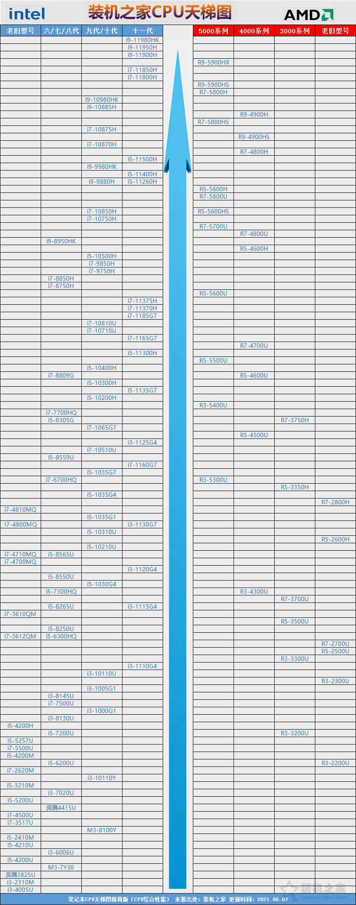

##### 盒装和散装

intel处理器，会有散装CPU和盒装CPU的可供选择，两者存在价格的差异。一些DIY会搭配散片CPU来降低装机成本，从而获得最大的性价比优势。

**散装CPU**，一般只有一个裸CPU，没有任何正规包装盒，也没有自带原装散热器，官方不认可的产品，无法享受正规官方三年售后服务，只能享受店保一年服务。散片CPU之所以便宜是因为基本都是国外逃税进来的走私货，或者是OEM厂商多余而通过各种渠道流到的市面的。

散装还分ES版、QS版与正式版，因为CPU的推出过程大概分这几个步骤：

1. ES1：测试架构和工艺制程；
2. ES2：修正大量BUG 这个时候的CPU已经能用了 但还存在隐患；
3. ES3(QS)：质量认证样品 型号确定，在电脑上能显示型号和规格 可能存在或不存在轻微隐患；
4. 正式版：正式出货；

因此我们在选购散装的需要注意，建议首选正式版散片CPU，我们可以通过CPU-Z软件可以检测出来。

**区别**：盒装CPU都自带了原装CPU散热器风扇，底部并带有硅脂，用户无需单独购买，除非想要获得更好的散热性能，才会去更换（注：有个别盒装CPU不会自带散热器）。而散装没有自带原装散热器，需要自行搭配第三方CPU散热器。

##### 主要参数

1. 架构（关键）

   CPU的架构越新越好，所谓的架构老与新，我们可以理解为有两个人搬砖，老架构的使用的落后的设备搬砖，而新架构使用的是更先进的设备搬砖，因此架构对性能的影响巨大，也是CPU最重要的参数之一。

2. 主频

   主频也是大家比较关心的参数之一，CPU的主频又叫CPU内核工作的时钟频率，我们也可以理解为CPU运算速度。CPU主频相当于人的力量，主频越高，那么力量（性能）则越大。

3. 核心/线程

   核心也就是所谓的核心数量，指的是CPU几核的，例如双核、四核、八核等，我们可以比喻为人的胳膊，双核就是两条胳膊，四核就是四条胳膊，胳膊越多我们同时进行的任务越多。单核单线程我们可以理解为一条胳膊长一只手，例如双核配双线程或者双核四线程、四核八线程的处理器

4. 缓存

   CPU运算速度较快，而内存读写速度跟不上时，CPU就可以将这些数据临时存储在缓存中，来缓解CPU的运算速度与内存条读写速度不匹配的矛盾，因此缓存越高越好。

#### 散热器

CPU散热器，目前常见的基本可以分为两种散热方式，一种是风冷散热器，另一种是水冷散热器。

##### **1、风冷散热器**

风冷散热器工作原理：CPU散热器传热底座与CPU紧密接触，由于CPU与散热器传热底座都是金属的，之间或多或少会存在空隙，而导热硅脂用途主要是填满CPU与散热器传热底座的空隙，通过导热装置，将CPU产生的热量传导至散热鳍片，最后由CPU散热器上的风扇吹走鳍片上的热量。  

风冷散热器一般分为拥有三种类型，分别是侧吹式散热器（塔式）和下压式散热散热器、被动式散热（无风扇设计）。

**选购风冷散热器需要考虑如下：**

**兼容性**，兼容性包括对**平台的兼容性**以及**体积上的兼容性**，对平台上的兼容性指的是，通常大多数的风冷散热器，能够同时支持intel和AMD两大平台，属于多平台扣具，但是也存在只支持intel或者只支持AMD平台的风冷散热器，intel原装散热器和AMD散热器就是一个最好的例子，所以我们选购散热器的时候一定要看下风冷散热器的适用范围参数，是否能够兼容。还有一种就是体积上的兼容性，由于部分高端的风冷CPU散热器，由于体积庞大且设计不良，会导致周边内存条、显卡等都无法安装，或者是超过机箱的限高，所以我们一定看一下机箱的限高对比下散热器尺寸的高度，是否已经散热器已经超出机箱的限高问题。

**材质**，我们知道，铜的导热性能表现是十分好的，但是由于铜金属较贵，成本太高，对于中高端散热器，**通常会将底座和热管做成铜的，而其它金属采用铝材料**，但其实这种设计十分合理，并且散热效果更好，因为铜材料的导热性能强，而铝材料的散热能力强，铝制散热鳍片和铜管是最佳搭配。

**热管**，理论上热管数量越多越好，由于散热器的底座与导热管是相连的，所以热管数量也会影响导热能力，例如相对便宜的塔式风冷散热器，只有两根热管，导热效果也会差一些。

**底座**，散热器是否导热快，绝大多数的因素取决于散热器与CPU处理器的底座接触面，由于工艺的不同，不同的CPU散热器的底座也是不同的，而高端散热器产品仍以镜面底座为主，让不少玩家都误认为热管直触散热器的性能并不如镜面底座性能好，甚至更有人认为镜面底座平所以性能好，但是实际上这些都是对于散热器底座设计的误解。

**鳍片**，通常散热器都是铝鳍片，为了就是散热更快，一般来说，鳍片越多，鳍片面积越大，散热越好。而鳍片越厚，鳍片越密集，散热越差。

##### **2、水冷散热器**

水冷散热器一般常见分为两种类型，分别是分体式水冷散热器和一体式水冷散热器，两种类型的水冷散热器区别如下。

**分体式水冷散热器**

分体式水冷散热器对于DIY玩家操作技术较高，分体式水冷自身成本较高，由于安装十分复杂与耗时，并会存在一个昂贵的安装费用，分体式还存在安装不到位导致的漏液风险，加之后期需要增加冷却液，所以只有一些发烧级电脑才会考虑，普通用户和主流玩家无需考虑。分体式水冷散热器由水冷头（块），冷却液，水泵，管道，水箱，冷排组成。

分体式水冷散热器工作原理：水冷头底部与CPU，显卡等设备的核心芯片相连（显卡也可以用水冷散热器，但是需要拆掉出厂自带的风扇，对DIY能力有一定的要求），顶部通常预留有管道口，通过管道与散热器相连，散热器再连接至水箱，水箱连接到冷排，将刚带出的热量通过冷排排出，使得CPU/GPU工作在合适温度。

**一体式水冷散热器**

一体式水冷散热器，一体水冷散热器由冷排，散热头组成，相比风冷散热器稍微好一些，相比分体式水冷散热器在价格上也亲民的多，并在安装步骤上十分简易，不用担心复杂的安装程序，后期也无需换冷却液，由于是一体式设计，更不用担心漏液的问题，一体式水冷散热器的水冷液在出厂时已经灌装完成，对于用户安装的话，只需要拧拧螺丝就可以完成安装，大大降低了CPU水冷散热的门槛。

#### 主板

intel和AMD两家每一次发布新款CPU的时候，都会向各大主板厂商提供适合自己CPU的主板芯片组，意思就是说，“我这个CPU已经做出来了，但是你们主板厂商需要按照我这个标准，做出来的主板才可以相互兼容”，所以在选购CPU的时候，一定要与主板接口保持一致，大部分情况下，不同代处理器搭配不同系列主板。

##### **intel主板等级分类**

intel主板芯片组，芯片组也是分等级的，而开头的这个字母就代表了芯片组的等级，不同等级的芯片组搭配CPU也有所不同的

- X：是最高等级，定位发烧级，一般搭配的CPU也十分高，例如目前在售的X299主板，主板有2066个针脚，搭配LGA2066接口处理器，比如i7 7820X、i9 7900X 、i9 7920X、i9-7980XE等处理器，这类主板和CPU价格十分吓人，偏发烧级别，家用根本没有必要。
- Z：定位高端级别，普通民用级里档次最高的，能够支持超频，这类主板通常支持内存频率也高一些，例如目前的Z390主板，一般最佳搭配是intel处理器型号后面带K（支持超频）后缀的处理器，例如i9-9900K、i7-9700K，i5-9600K等。
- B：定位中端主流级别，性价比最高，不支持超频，一般酷睿不带K的处理器都是上B系列主板，例如目前在售的i3-8100、i5-8400/8500、i5-9400F、i7-8700等处理器，搭配的是B360主板。
- H：定位入门级，便宜一些，同样不支持超频，一般建议搭配intel赛扬、奔腾级别的处理器，例如目前在售的H310主板，搭配G4900、G5400之类低端、偏入门的处理器。

##### **AMD主板等级分类**

AMD平台的主板芯片组命名规则与英特尔类似，有X、B、A三个档次。

X：高端系列，支持超频，例如目前在售的X370主板，一般搭配锐龙 R7 2700X之类的处理器。

B：定位中端主流级别，AMD相比intel更有良心，几乎所有的锐龙处理器都支持超频，而主流级别的主板也能够支持超频，例如B450主板，一般搭配锐龙R5 2600、R7 2700之类的处理器。

A：定位入门级，不支持超频，一般适合偏入门的处理器，例如目前在售的A320主板，一般搭配速龙200GE之类的入门级处理器。

##### **尺寸**

主板常见的板型有E-ATX加强型、ATX标准型、M-ATX紧凑型、MINI-ITX迷你型。

- E-ATX型主板属于高性能主板，一般会有8根内存插槽，主板芯片组基本是X等级的，家用级基本不用考虑这类主板。
- ATX型主板就是俗称的“大板”，这类主板的体型稍大，扩展性强，接口十分丰富，一般搭配了4根内存插槽，例如Z370、Z390主板，大多数都是ATX板型的。
- M-ATX型主板是目前使用最多的主板板型，相比ATX板型要短一些，基本接近了正方形，俗称“小板”，扩展性尚可，一般内存支持2根或者4根。
- MINI-ITX就是紧凑型主板，一般会使用在ITX迷你机箱内，不过ITX的主板价格偏高一些，性价比不好，适合喜欢较小的主机人群。

主板的板型大小根本不能判断一个主板的好坏，大板和小板一般在接口数量上有所区别，也就是扩展性，性能上毫无差别。主板并不会影响电脑性能，因此实际装机大小板可以按照兼容性要求和性价比来选即可。

##### **接口：**

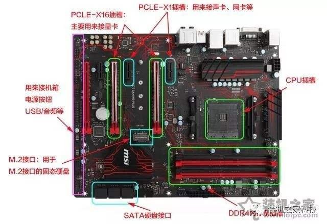

目前，主板的CPU插槽主要是CPU型号决定的，关乎着兼容，不同接口无法兼容。内存插槽的数量，关乎着内存可以插几根，如果搭配M.2固态硬盘，一定要看主板是否支持M.2接口，M.2最好是全速的，非全速的接口，无法满足M.2 NVME高速固态硬盘需求，与普通SATA固态速度无异，还有USB 3.1/3.0，千兆网卡接口（现在的最新主板都是千兆网卡了）。

##### **品牌：**

1、华硕主板，定位一线品牌；

2、技嘉主板，定位一线品牌；

3、微星主板，定位一线品牌；

#### 显卡

##### **显卡的作用**

显卡主要是承担输出显示图形任务的，显卡的作用主要就是将CPU发出来的图像信号经过处理之后再输送到显示器进行显示，这个过程通常是包括四个步骤：

1、首先CPU将数据通过总线传送到显卡的显示芯片；

2、显示芯片对数据进行处理，并将处理的结果存放在显存中；

3、显存将数据传送到RAMDAC（随机数模转换记忆体），并进行数/模转换;

4、RAMDAC将模拟高频信号通过显示接口输出到显示器成像。

##### **集成显卡和独立显卡**

独立显卡是独立的一个硬件，而早期的集成显卡是集成在主板上的，而现在的集成显卡是内置在CPU中的，我们又叫核心显卡，由于核心显卡是内置在CPU中的，所以由于CPU功耗控制、发热量问题，核心显卡通常性能十分低端，目前性能最好的核心显卡，也只能媲美入门级低端显卡，如果想要追求更好的显卡性能，只能上独立显卡。

独立显卡，目前分为两大阵营，即NVIDIA和AMD，是显卡芯片的生产厂商，也就是用户经常说的N卡和A卡，其中NVIDIA的市场份额最大，从入门到高端产品线十分全面，而AMD主打性价比，产品线相比之下不算全面，基本上是通过性价比方式来主打一些主流级显卡，高端显卡基本上没有AMD什么事情。

##### **显卡型号的含义：**

**1、N卡的芯片型号含义：**

N卡的型号由前缀+数字组成。（例如GTX1660，RTX2080Ti，型号后缀带Ti代表加强版）

目前前缀分别为GT、GTX、RTX开头，GT定位低端，GTX定位中低端或者以上级别，自从RTX20系发布之后，GTX性能最大只能到主流级，而RTX现在就是NVIDIA高端显卡的代表，支持光线追踪和DLSS技术，理论上其后面的数字型号则是越大性能越强！

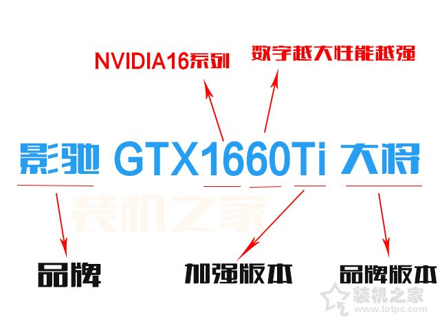

N卡的芯片型号含义

**2、A卡的芯片型号含义：**

以目前最新的北极星架构显卡来说，比如型号是RX+XXX，以RX开头的，其后面的数字型号则是越高性能越强！

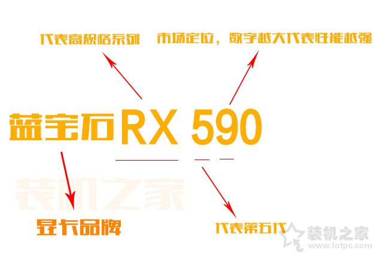

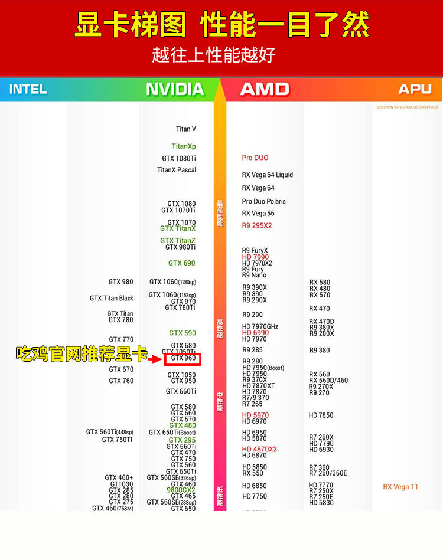

##### **核心参数**

1. **显卡架构**

   可以理解是所使用的技术，每一代显卡架构越新，那么技术就会越成熟，计算能够就越强，例如CPU提升制程工艺，纳米数越小，就意味着相同面积内晶体管数量越大，所以性能也就越强，并且还减少了电能消耗，降低发热量

2. **显卡流处理器**

   在参数中看到的CUDA核心，就是所谓的流处理器（渲染管），简称SP，理论上数量越多代表性能越高，显卡画图的能力就越强，速度也越快。当然我们在对比显卡流处理器数量的时候，必须要同一代显卡进行对比才有意义。

3. **核心频率**

   显卡的核心频率是指显示核心的工作频率，其工作频率在一定程度上可以反映出显示核心的性能，核心频率越高，那么显卡的性能就越强，当然就会造成显卡功耗越高。

4. **显存类型**

   显存确实对于显卡性能有影响，常见显存类型有GDDR5、GDDR5X、GDDR6、HBM、HBM2；

5. **显存带宽**

   显存带宽是指显示芯片与显存之间的数据传输速率，它以字节/秒为单位，显存带宽是决定显卡性能和速度最重要的因素之一，显卡带宽的计算公式是**显存位宽×显存频率=显存带宽**。

6. **显存容量：**

   显存就是祯缓存，通俗说就是个临时性的数据蓄水池，用于显卡图形处理渲染数据临时存储，显存容量越大，缓存的数据越多图形渲染能力越强。

7. **显示接口**

   常见的显卡显示接口有VGA、DVI、HDMI、DP，好坏排序是DP>HDMI>DVI>VGA，其中VGA接口属于模拟信号，在目前的新显卡中，已经完全淘汰了，DP、HDMI、DVI属于数字信号，我们目前基本以DVI和HDMI为主流显示接口，而DP规格最高，例如144Hz刷新率的电竞显示器，我们就需要DP接口才可以支持，HDMI目前最高只能上120Hz刷新率。

8. **光线追踪和DLSS技术**

   NVIDIA RTX系列显卡最大的亮点就是在于具备光线追踪和DLSS两大技术，其中光线追踪技术能够为游戏玩家带来更加逼真的游戏画面，让游戏拥有电影级画质，其实所谓的“光线追踪”技术，就是利用算法来模拟真实世界中的光线的物理特性，能够做到物理上精确的阴影、反射和折射以及全局光照，在虚拟的游戏场景下，让游戏中的物体更加具有真实感。

9. **显卡品牌**

   N卡建议选用华硕、技嘉、微星、索泰、映众、七彩虹、影驰、铭瑄、耕升等；A卡建议选用蓝宝石、迪兰

#### 内存

笔记本内存条和台式机内存条长度是不一样的，台式机内存相比笔记本内存要长一截

##### **内存作用**

内存在电脑中的作用相当于一座桥梁，主要负责例如硬盘、主板、显卡等硬件上的数据与处理器之间数据交换处理，与硬盘不同的是，内存属于临时存储，速度也较快，电脑中所有运行的程序都在内存中运行的，您只要重启电脑，就会清空之前所打开的程序。当一款软件打开之后，数据就会存放在内存之中，速度超快的内存与CPU超高速度进行数据传输，这就是为什么你打开软件和游戏需要等待很久，而在软件使用和游戏中并不会卡顿的原因了，当我们关闭软件之后，清理后台进程的时候，内存的数据就会被清空了。

##### **内存代数**

内存代数有DDR、DDR2、DDR3、DDR4，之间无法相互兼容，目前DDR、DDR2、DDR3已经淘汰，目前新装机或者笔记本都是DDR4代数的内存

##### **内存频率**

例如8G DDR4 2400MHz，这里的2400MHz就是内存频率，我们可以理解是内存的数据传输速度，理论上内存频率越高，速度越快。

DDR4内存为例，一般主流电脑我们选择2400MHz、2666MHz也就足够了，想要高频上3000Mhz或者3200MHz就可以

当然也会受主板和CPU的限制，如果你的主板支持最高DDR4 2666，您使用3000MHz频率，虽然能够兼容，但是内存频率会降至2666MHz。此外，如果您主板能够支持3000MHz，购买一根3000MHz内存，而发现内存频率只有2133MHz，我们需要在主板开启XMP模式，调至3000MHz频率

##### **内存时序**

内存时序是描述同步动态随机存取存储器性能的四个参数：地址访问潜伏时间（CL）、行地址到列地址等待时间（TRCD）、行地址预充电时间（TRP）和行地址活动时间（TRAS），单位为时钟周期，数值越小代表越好，其中CL值，也就是时序当中首个数字是确切的周期数，CL对内存性能的影响是最明显的，所以很多产品都会把内存CL值标在产品名上，而后面的三个数字都是最小周期数。内存时序参数影响随机存储存储器速度的延迟时间，较低的数字通常意味着更快的性能，所以在同代同频率的情况下，内存时序越小越好，一般情况下大家只需要看内存时序中的第一个数字，也就是CL值，数字越小越好。

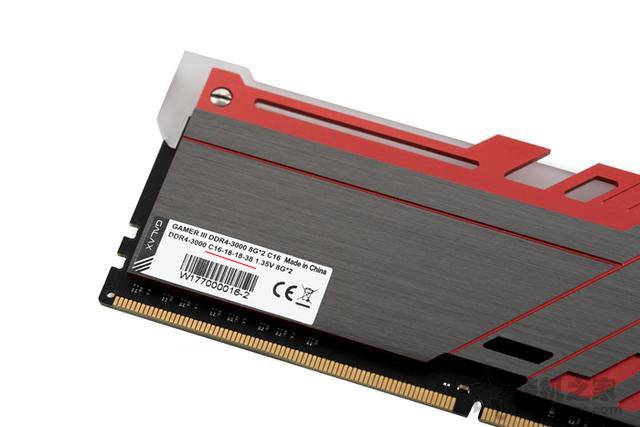

**举个例子：**

内存的时序就是我们这个仓库的物流人员找到货物，并把货物装上车的时间，一般来说，货车的载重越大（内存条的频率越高），物流人员找到这些货物和装车所耗费的时间也就越长，所以如果是相同频率的内存条，时序CL值是越小越好（表示物流人员工作效率高）。

目前普通的DDR4内存，主流频率为2400MHz，时序是CL15-17数值左右，但是一些使用极品颗粒的超频内存，例如三星的B-die颗粒就可以轻松做到频率3200MHz，并且时序只有CL12，这类极品内存可以做到保证时序不超标的情况下，超频上4000MHz以上。

##### **内存颗粒**

内存颗粒就是内存条PCB板上面黑色小方块的东西，存储数据的东西，目前主流的内存颗粒生产商有三星、海力士、镁光这三家，如果谈品牌好坏的话，排序是三星>海力士>镁光，当然每一家都有高中低不同档次的显存颗粒，在生产时候会有质量参差不齐的情况，所以一些成色极品的颗粒会被挑选出来做成高端超频内存条，而一些成色普通但合格的颗粒会被拿去做成普通内存条。

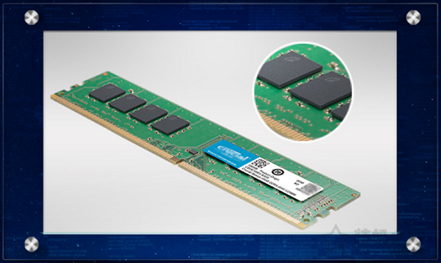

##### **内存PCB板**

PCB板就是电路板，一般内存厂家会说自家的内存是8层或者10层PCB板，PCB板子层数增加后，不仅厚实，电路板内部的电路走线层数增加，这样电路走线就不会那么拥挤，可以适当增加每根铜线的宽度，这样就会有更好的电气性能，使得超频更加稳定。

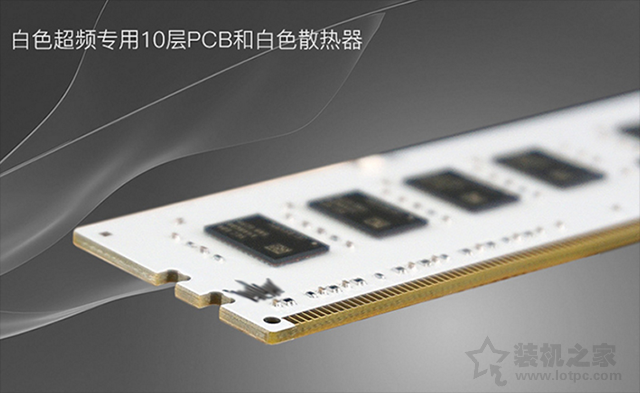

 

##### **内存单通道和双通道**

通常单根内存只能组建单通道，内存想要组建双通道至少需要两根内存。如果主板拥有四根内存插槽设计，需要插入两根内存的情况下，我们需要将内存插入1和3插槽或者2、4插槽隔插即可，而主板拥有两根内存插槽，插满就是组建双通道了。

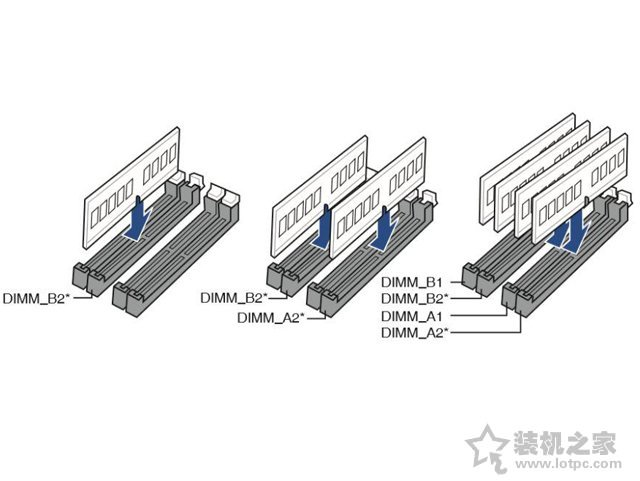

内存单通道和双通道插法

**双通道有什么好处？**

CPU与内存之间的数据传输是有来有回的，单通道就相当于一条马路分了左右车道，一个车道负责去，一个车道负责回，虽然秩序井然但是由于马路（带宽）较窄，数据流量不会很大。双通道就相当于又修了一条同样的马路，这样的话，这两条马路一条负责收，一条负责发，马路整体（带宽）宽了一倍，流量自然也就增加了。双通道能够为电脑带来一些性能提升，尤其是核显电脑，由于CPU要同时负责程序数据和显示数据的处理，需要的数据流量更大，所以双通道带来的双倍带宽才能满足这么大的数据流量的需求。

**内存是单根16G还是两根8G好？**

个人建议选择两根8G内存组建双通道，理论上内存双通道可以提高内存带宽，也就是CPU与内存之间的数据交互量增大，以达到提升性能的目的，不过在对内存依赖的程序里才会有用。但是实际上，在日常使用、压缩文件等，内存双通道提升并不明显，也无法直观的感受性能的好坏。

#### **硬盘**

##### **固态硬盘Solid State Drive**

简称SSD，固态硬盘在机械硬盘之后推出的新型硬盘，固态硬盘主要是由多个闪存芯片加主控以及缓存组成的阵列式存储，属于以固态电子存储芯片阵列制成的一种硬盘。它完全突破了传统机械硬盘带来的性能瓶颈，由于固态硬盘具备高速读写性能，通常我们将系统安装在固态硬盘中，大大提升了系统开机速度以及系统流畅性。

##### **固态硬盘优点和缺点**

固态硬盘相比机械硬盘主要优点在于读取速度更快，寻道时间更小，能够大大提升系统、软件、游戏等读写速度，由于固态硬盘内部与机械硬盘结构不同，非机械运动，有点类似U盘，所以静音，没有噪音，防震抗摔性佳，功耗低、发热小，轻便小巧。而缺点就是在于与机械硬盘同容量下价位偏贵，所以通常大家会选择容量较小的固态硬盘，一般主流容量在240G-512G之间。

##### **固态硬盘接口**

关于固态硬盘接口，目前市场常见的可以分为三种类型，即**SATA接口、M.2接口、PCI-E接口**，目前装机最主流选用最多的就是SATA和M.2接口，PCI-E接口定位高性能发烧人群，在价格上也偏贵。

- **SATA接口：**SATA接口是主板十分普遍的接口之一，传统机械硬盘、光驱也采用这种类型的接口。目前最高版本是SATA3.0 6Gb/s，最大传输速度为6Gbps，实际速度最大为560MB/s，由于带宽受限，读写性能无法突破瓶颈，所以M.2 NVMe固态硬盘应运而生。SATA接口的固态硬盘尺寸为2.5英寸，与笔记本机械硬盘尺寸相同，相比台式机机械硬盘3.5尺寸小一些。

- **M.2**是一种固态硬盘新接口，优势就在于体积比普通的SATA更小，是Intel推出的一种替代MSATA新的接口规范。M.2接口分两种类型，分别支持SATA通道与NVME通道，其中SATA3.0只有6G带宽，与普通SATA固态硬盘速度上差异不大，只是接口区别，而后者是走PCI-E通道，能提供高达32G的带宽，NVME作为新一代存储规范，由于走PCI-E通道带宽充足。数据直接通过总线与CPU直连，接近最大的传输速度，最大的数据量，直接省去了内存调用硬盘的过程，所以速度更快，不过价格也贵上不少，所以大家选购M.2固态硬盘一定要注意一下，尽量考虑M.2 NVMe协议的固态硬盘，还有就是主板上必须配备M.2接口。M.2固态规格上，长度有2242、2260和2280三种规格，目前主流就是2280规格。

- **PCI-E接口**

  PCI-E硬盘最开始主要是在企业级市场使用，因为它需要不同主控，所以，在性能提升的基础上，成本也高了不少。至于消费级市场，对该产品并没有太大需求，只是在这两年，PCI-E硬盘才开始在高端消费市场流行起来。目前AMD已经推出了首款支持PCI-E4.0的X570主板，可以支持PCI-E4.0固态性能，迄今速度最快的SSD，连续读取速度将轻松超过5000MB/s，连续写入速度超过4500MB/s，适合数据中心企业级或者发烧友。

固态硬盘主要是颗粒和主控方面，固态硬盘的颗粒与主控好坏决定了一款固态硬盘的性能，颗粒与主控越好，无疑固态硬盘的速度越强。

##### **固态硬盘颗粒**

目前固态硬盘的颗粒主要有QLC、SLC、MLC、TLC颗粒，

**（1）SLC（单层存储单元）**

SLC全称是Single-Level Cell，单层电子结构，每个cell可以存放1bit数据，SLC达到1bit/cell，写入数据的时候电压变化区间小，P/E寿命较长，理论擦写次数在10万次以上，但是由于成本最高，所以SLC颗粒多数用于企业级高端产品中。

**（2）MLC（双层存储单元）**

MLC全称是Multi-Level Cell，使用高低电压的而不同构建的双层电子结构，MLC达到2bit/cell，P/E寿命较长，理论擦写次数在3000-5000次左右，成本相对较高，但是对于消费级来说也可以接受，多用于家用级高端产品中。

**（3）TLC（三层存储单元）**

TLC全称是Trinary-Level Cell，三层式存储单元，是MLC闪存延伸，TLC达到3bit/cell，由于存储密度较高，所以容量理论上是MLC的1.5倍，成本较低，但是P/E寿命相对要低一些，理论擦写次数在1000-3000次不等，是目前市面上主流的闪存颗粒。

**（4）QLC（四层存储单元）**

QLC全称是Quad-Level Cell，四层式存储单元，QLC闪存颗粒拥有比TLC更高的存储密度，同时成本上相比TLC更低，优势就是可以将容量做的更大，成本上更低，劣势就是P/E寿命更短，理论擦写次数仅150次，QLC必将迎来未来大容量固态硬盘时代。

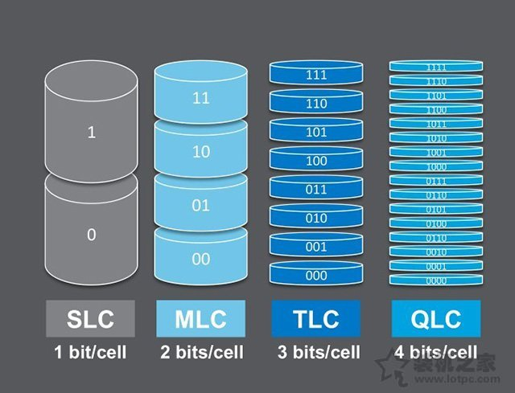

##### **固态硬盘主控**

如今，固态硬盘使用的主控芯片主要是群联、慧荣、智威三个芯片厂商，而NAND芯片主要是三星、海力士、镁光、东芝、Intel、闪迪这些巨头把控。目前市面上的闪存芯片可以分为原片（正片）、白片和黑片三种：

**（1）原片**

原片指的是闪存颗粒顺利的通过了晶圆厂原厂的筛选以及故障检测，并在芯片的表面上印上了圆厂LOGO和型号参数等信息，例如三星、闪迪、海力士、东芝、镁光等。

**（2）白片**

白片指的是通过了晶圆厂筛选，但是没有通过原厂故障检测，硬盘厂商采购后自己进行筛选的合格闪存颗粒。通俗来说，就是有点瑕疵，但是白片还是有品质保障的，一般被二线硬盘厂家所采用。

**（3）黑片**

黑片指的是没有通过任何的故障检测，故障率最高的废片，通常会被杂牌的硬盘厂家所采用。

##### **机械硬盘**

是一款传统式硬盘，在没有固态硬盘之前都是搭配的机械硬盘，目前装机搭配机械硬盘多数作为存储副盘。机械硬盘的结构主要是由一个或者多个铝制或者玻璃制成的磁性碟片、磁头、转轴、磁头控制器、控制电机、数据转换器、接口以及缓存等几个部分组成。在机械硬盘在工作的时候，磁头悬浮在高速旋转的磁性碟片上进行读写数据。

##### **机械硬盘优点和缺点**

机械硬盘英文名为Hard Disk Drive，简称HDD，最大优势就是在于容量大，价格便宜。传统的机械硬盘采用的是高速旋转的磁盘来存储数据，通过磁头来进行读写，在这个机械运动过程中会存在延迟，并且无法同时迸发多向读写数据，目前的机械硬盘已经遇到了速度瓶颈。

##### **机械硬盘接口**

现阶段的机械硬盘主流接口都是SATA3.0类型的，IDE、SATA1、SATA2接口都属于机械硬盘老接口，其中SATA1、SATA2接口可以互相兼容，主要是传输速率不同，SATA1.0为理论传输速度为1.5Gbit/s，SATA2.0为理论传输速度为3Gbit/s，SATA3.0为理论传输速度为6Gbit/s。此外，IDE是老式的机械硬盘接口，理论传输速度仅有100或166MB/S，由于传输速度较慢，因此被淘汰

**机械硬盘转速**

目前市面上的主流机械硬盘，转速一般是7200转，部分会有5400转，建议首选考虑7200转。一般来说，机械硬盘转速越高，那么内部传输率就越快，读写速度越快，也就是机械硬盘的速度越快，但是发热量也随之增加。

**机械硬盘缓存**

除了转速影响机械硬盘的速度以外，机械硬盘的缓存大小也是影响速度的重要参数，机械硬盘存取零碎数据的时候需要不断的在硬盘与内存之间交换数据，如果机械硬盘具备大缓存，可以将零碎数据暂时存储在缓存中，减小对系统的负荷，也能够提升数据传输速度。

##### **单碟容量越大性能越高**

目前，对于机械硬盘来说，单盘片容量越大，机械硬盘可储存的数据就越多。传统机械硬盘主要由磁盘和磁头组成，由于体积的限制，每个机械硬盘腔体所能安放的盘片也有限。要在有限的盘片里增大机械硬盘的容量，就只能靠提升碟片的存储密度。通过垂直记录技术，不但盘片的容量提到了一个新高度。与此同时，由于盘片数据密度的增加，机械硬盘的持续传输速率也获得了质的提升。

**固态+机械双硬盘最佳方案**

如果固态硬盘容量在不够用的情况下，也可以考虑固态+机械双硬盘方案，满足高速与大存储需求，通常系统安装在固态硬盘中，提升开机速度以及系统流畅性，同时常玩游戏与常用软件也建议放入固态硬盘中，减少载入延迟时间，而机械硬盘的作用就是仓储，用于存放各种资料、小电影、照片等等，显得十分合理。

#### 机箱

考虑机箱的板材质量、兼容性以及合理性

主要作用

是放置与固定各种电脑硬件，起着承托和保护作用，有效保护着内部硬件免受损伤，并且一些电脑机箱具有一定的屏蔽电磁辐射、静音等重要作用。虽然它与电脑的性能挂不上钩，但是如果一款机箱的板材较差，会导致主板和机箱形成回路，从而导致了短路，怎么搞都无法开机，从机箱拿出之后裸点就没有任何问题。

**结构**

目前常见的机箱结构主要有ATX标准型、Micro-ATX紧凑型、MINI-ITX迷你型三种规格，结构决定了机箱与主板的兼容性，其中ATX标准规格的大机箱，除了能够支持ATX板型的主板，还能够支持M-ATX板型，甚至是MINI-ITX迷你型板型的主板，可以向下兼容。而Micro-ATX不能支持ATX规格的主板，只能向下兼容，支持M-ATX紧凑型主板以及MINI-ITX。不过MINI-ITX的机箱选择，只能选择ITX板型的主板，另外电源也是非ATX标准的，一般都是SFX型小电源。

**接口**

机箱的接口常见的是USB2.0、USB3.0以及音频接口，有些入门机箱不带USB3.0，建议选用带有USB3.0接口，因为如果有USB3.0的U盘或者移动硬盘，速度相对要快上不少。

**散热性：**

对于偏高端的硬件，更多的就是考虑机箱散热性，散热性较好的机箱，通常会设立多处通风位，包括机箱前置面板、上置面板，后置面板，并且可以安装散热风扇以及水冷冷排，提升机箱内部风道，如果安装风扇，一定要注意风道问题，通常前置面板安装的风扇是进风，而上置面板和后置面板是出风。

下**置电源设计：**

传统机箱都是上置电源，而如今越来越多机箱开始流行下置电源设计，目前不少机箱为电源提供了独立仓，下置电源的好处就是让电源和主机内部其它硬件分开，进行独立散热，电源下置风扇朝下是为了吸入更多的冷风，以达到更好的散热，电源自身以及机箱内部散热条件得到了改善，风道更加通畅，所以更建议下置电源设计。

**机箱走背线**

最大的好处就是让机箱内部更加美观，否则机箱内部的线材将会凌乱不堪，再宽大的空间，其利用率也会变得非常低，或多或少会影响机箱内部散热。并且机箱背线设计要合理，如果背板空间不足，可能会遇到扣不上侧板的问题，一般背线应预留出1.5cm以上的空间才算合理。

**EMI弹片设计**

机箱上EMI弹片设计，就是为了密合机箱缝隙，增强板材接触，能防止电磁波外泄，干扰其他设备。

##### **兼容性考虑（选购重点）**

机箱的兼容性是非常重要的，会造成无法安装的情况，所以我们在选择机箱的时候一定需要考虑的问题，也是小白经常会遇到的问题。

**1、机箱结构与主板尺寸规格兼容性**

机箱的结构主要有ATX标准型、Micro-ATX紧凑型、MINI-ITX迷你型三种规格，ATX结构机箱除了支持ATX，还可以向下兼容。支持Micro-ATX和MINI-ITX，如果是Micro-ATX结构的机箱，就无法兼容ATX大板了，支持Micro-ATX，MINI-ITX主板，只能向下兼容，向下兼容，向下兼容，说三遍。此外，有些Micro-ATX架构的机箱，由于机箱偏小，对主板尺寸有点要求，一定要选择机箱提供的主板尺寸内的，切记，同样是Micro-ATX板型的主板，也有尺寸区别。

**2、独立显卡长度**

一些偏小尺寸的机箱都有独立显卡长度限制的，特别是高端显卡，尺寸较长，一定要查看下机箱的独立显卡支持长度，是否满足该独立显卡长度需求。

**3、CPU散热器的高度**

有些入门的机箱或者尺寸较小的机箱，对CPU散热器的高度也有限制，选择的CPU散热器一定要在机箱的CPU散热器限高范围中即可，否则出现无法盖上机箱侧板的情况。

**4、机箱是否光驱位**

由于目前光驱的使用率不高，基本属于淘汰期，所有导致了目前大多数的机箱取消了光驱位，不过也有特殊人群，就是需要光驱，所以选择机箱一定需要支持光驱位的。当然我们也可以选择购买USB光驱，可以解决这个问题。

**5、机箱是否水冷**

对于一些高端人群，可能会有水冷散热需求，无论是一体式水冷还是分体式水冷，都有一个冷排，冷排的规格有120MM、240MM、280MM、360MM，也需要机箱支持才可以，如果机箱只支持240MM规格水冷排，你购买一个360MM水冷，那肯定无法兼容。

#### 电源

**电源尺寸**

分别分为ATX和SFX两者尺寸规格，选择电源的尺寸主要是看机箱支持什么尺寸电源，我们最主流常用的电源尺寸是ATX标准电源，尺寸一般为150*140*86mm，有些电源可能适当会短一些，而SFX尺寸电源比较小众，尺寸相比ATX标准电源偏小，SFX尺寸为125*100*63.5mm，主要用于ITX、HTPC机箱。

##### **电源功率**

电源功率主要是看额定功率，而不是最大功率，所以建议不要考虑杂牌电源，因为有功率虚标的情况，常常只写上最大功率。市面上电源从额定功率一百多瓦到一千多瓦均有，目前平台建议额定300W起，电源买多大功率主要是取决于所有的硬件的功耗总和，再适当放宽一些功率空间，以便在超频或者升级备用。一般是将所有的硬件的功耗相加总和再加上100W就是你所需的电源额定功率，如果电脑电源功率不够，就会造成电脑出现自动重启的情况，如果电源功率过大，虽然不会更费电，但是购买电源会贵很多，通常以硬件工作状态所需的耗电量来决定的，电脑电源仅仅是一个“能量池”，瓦数越大能负载的电量就越多。

下图是一款额定功率450W电源。

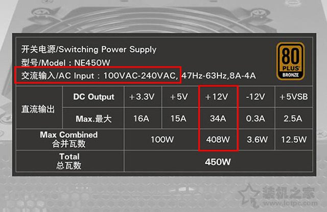

单路12V

**最关键就是+12V，还需要区分单路和双路12V（伏）**

通过电源铭牌能够看出来，交流输入电压为100V-240V，也就是我们所谓的“宽幅电源”，你家里的电压需要在这个范围内才可以使用，国内家庭用的电压都是220V，国外也会有110V的。在参数中，**+12V这一路最重要，主要是提供显卡和CPU两大硬件的供电**，所以我们可以作为功率选择的标准，其他的+3.3V、+5V之类的都是耗电非常少的硬件，所以基本不用考虑，平时也肯定足够使用的。

**单路+12V**

如果只有一个+12V，如上图电源铭牌，说明是单路12V，单路+12V是对CPU和显卡进行集中供电，所以只要你的显卡和CPU的功率之和小于这个值就可以了，并有几十瓦余量就足够了。功率计算非常简单，就是用电压12V×电流（A）。如上图所示的电源举个例子：12V×34A=408W。

**双路+12V**

还有一种是双路+12V，电源铭牌上会标注+12V 1和+12V 2两路输出，+12V 1主要是提供显卡供电的，而+12V 2主要是提供CPU单独供电的。例如下图电源铭牌，+12V 1显卡供电公式，12V*18A=216W。

单路12V和双路12V电源在性能并没有明显的优劣之分，个人更建议单路12V电源，如果您的显卡显卡满载功耗超过了+12V 1，那么就会发挥不了显卡的最佳性能，而功耗较少的CPU供电有着较大的供电余量，导致了电源功率浪费。如果按设计的初衷，双路12v可能考虑的更周到，为了安全稳定来限制电流，不过同时这也是它的弊端。

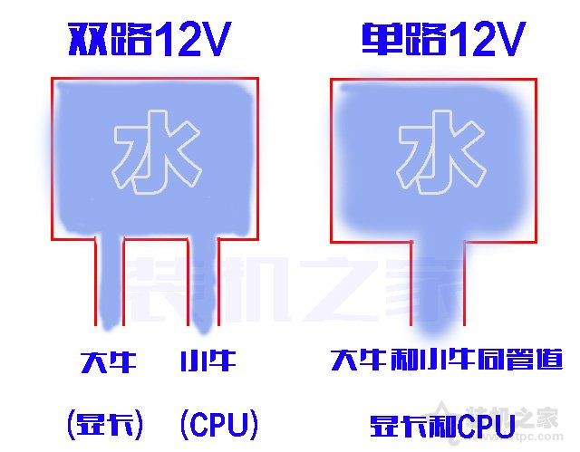

双路12V 和 单路12V 的区别

例如功耗较高的显卡我们比喻为大牛，而CPU比喻为小牛。一个牧场中，有一个水箱装满了水，水分别分流到一个小牛和一个大牛的房间内，无疑大牛无疑喝的水比较多一些，小牛喝的比较少一些，但是会出现一个问题，由于小牛和大牛分配的水是差不多的，就导致了大牛可能会不够喝，而小猪喝不完的现象，也就是双路12V可能会出现的问题。但是如果大牛和小牛在一个房间内，将两根水管合并为一根粗水管，大牛和小牛一起喝，这样两者都足够喝，也不会出现浪费的情况。

**模组电源**

电源分非模组和模组电源，由于模组电源价位上偏贵，一般入门电脑不用考虑，一般中高端或者以上的主机可以考虑。非模组和模组电源最大的区别就是在于线材是否分离，非模组电源是十分常见的，也是使用广泛的，一般我们配的电脑都是非模组的电源，电源上集成了所有的线材，线材与电源不分离，而模组电源的线材和电源是分离的，也就是说，我们需要接哪根供电线，就用哪根线。模组电源最大的好处是机箱背部走线更加完美，没有多余的线材，更加美观，还可以定制线，缺点是价格偏贵。模组电源还可以细划化，全模组和半模组电源，全模组所有的线材都是与电源分离的，均可拆卸，而半模组是重要线材固定，部分线材可拆卸。

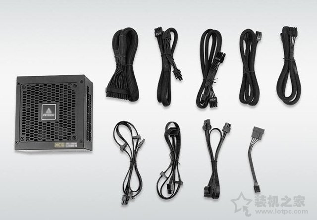

#### 显示器

##### **参数**

**色域：表示能显示的色彩范围**

色域就相当于尺子的长度，20cm的尺子比10cm的尺子能测量的范围更广，所以广色域的显示器比低色域的显示器能显示的色彩更多。（主流的显示器有NTSC和sRGB两种色域范围，这是两个不同的标准，一般72%NTSC=100%sRGB。所以不能直接按数字对比）

**色深：表示色彩的精细程度**

色深相当于尺子上的刻度，色深越大，刻度越多，每个刻度表示的距离越精细。比如同样是1米的尺子，A有100个刻度，每个刻度表示1cm，B有10个刻度，每个刻度表示10cm，那么A测得的尺寸就会更加精确。市面上的显示器色深一般为6-8bit，更好的有10bit的，高色深的显示器色彩更加精细，色彩过度平滑。

**色差：色彩还原的准确性**

以deltaE值作为单位，这个值越小，色彩还原越准确，一般绘图用的显示器deltaE值要小于3。

对比度：对比度越高，色彩表现越清晰丰富，这个很好理解，直接看图对比。

**刷新率hz：**表示显示器一秒能刷新多少帧图像

我们在屏幕中看到的任何视频动画图像都是由一张（帧）张（帧）的图片快速播放而形成动画的，目前显示器主要有60Hz和144Hz两种，在显卡性能允许的情况下（可以看游戏帧率），144Hz的画面比60Hz更加流畅，顺滑。

**灰阶响应时间：可以理解为画面延迟**

就是显示器从上一帧图片切换到下一帧图片的间隔时间，以毫秒ms作为单位。这个时间越短，说明画面切换的越快越干净。如果灰阶响应时间过长，画面就会出现拖沓，模糊，拖影的现象。普通显示器为6-8ms，专业电竞游戏显示器为1ms。

**分辨率：表示图像的清晰程度**

同一尺寸下，分辨率越大，画面越清晰精细；分辨率越小，画面越粗糙，颗粒感越重。所以一般24英寸以下显示器建议1080P，而建议是超过27寸的显示器就要使用2k分辨率的屏幕了，屏幕过大，分辨率低的话，容易看出颗粒感。

##### **液晶面板的区别**

**1、TN面板**

TN面板的优点是：液晶分子偏转速度非常快，所以灰阶响应时间很短。缺点是：色域窄，色彩差，画面色彩苍白，可视角度很小，有条件的可以用手机屏幕对比一下老式的便宜的笔记本电脑屏幕。这种屏幕本来快被市场淘汰了，但是随着电竞的火热，TN面板借着刷新率高，灰阶响应时间短的优点又重新回到市场，散发第二春。

**2、IPS面板**

IPS面板的优点：色彩显示效果好，可视角度大，色彩准。缺点是：容易漏光，黑色不够纯正。这类显示器由于色彩好，可视角度大，所以也是现在应用最广的显示器面板。

**3、VA面板**

VA面板有两种：MVA面板和PVA面板，PVA是三星改良的MVA面板。这类面板算是TN面板和IPS的折中方案，优点是色彩准确，对比度高，可视角度较大，漏光少，黑色纯正。缺点是响应时间比IPS还要长。

PLS面板：PLS面板是三星独家研制的面板，类似IPS面板。

#### 键盘

**机械键盘和普通键盘的区别**

1. 机械键盘最大的特点在于其独特的**手感**、**多键无冲突**和**超长的寿命**，并且触发单元是**轴体**，每一个键都是独立的轴体，
2. 普通薄膜键盘之间的则是采用的三层塑料薄膜，使用起来就更偏绵软，回弹力稍显不足了，一般是3键无冲突，手感一般，寿命短，造价低。
3. 价格上，机械键盘成本相比普通薄膜键盘要贵的多，毕竟每一个键的轴体都是独立的。

##### **机械键盘轴体**

**1、黑轴**

黑轴的段落感最不明显，声音较小，轴的寿命也较长，在游戏中有上佳的表现，并且键程极短，比较适合游戏玩家，不过我们在使用黑轴机械键盘的时候需要很大力才能按下去。

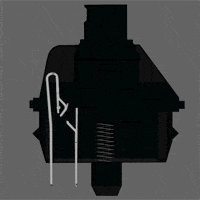

**2、红轴**

红轴就是为了解决黑轴的问题而诞生的，不同于黑轴的大力，红轴的力度比较软，而且轻盈，但是按压的感觉又告诉你这不是薄膜键盘，能够很好兼顾游戏和打字的使用需求。

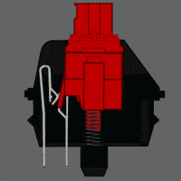

**3、青轴**

青轴的打字的时候，会发出较大的咔哒咔哒声音，家中宝宝睡觉而电脑同一个卧室不建议推荐，估计宝宝会被吵醒。青轴打字节奏感十足，并且回弹力度很大，触发较慢，只适合打字，但是不太推荐游戏使用。

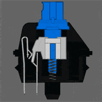

**4、茶轴**

茶轴介于红轴和青轴之间，有段落感，但是没有青轴那么重，而且需要按压太大力，和青轴完全不同的体验，不弹手，十分适合想要段落感的人，适合办公，也适合游戏，属于万能轴，比较奢侈的机械轴，结合了青轴与黑轴的特点。

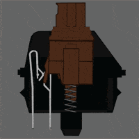

我们在说说其它轴体，关于绿轴，我们一直都不太推荐用户选择，比青轴段落感还要重。而银轴的话，相比红轴更容易触发一些，不过键盘较少。此外，还有国产轴，第一梯队的是凯华轴，手感上基本也和cherry轴相仿。

##### **机械键盘键帽**

机械键盘的键帽材质方面，常见的有ABS、POM、PBT三种，我们来简单科普一下这三种材质的键帽不同之处。

**1、ABS键帽**

ABS键帽是机械键盘中采用最多的，成本较低，而且因为材质本身能够做半透明，所以也被RGB键盘所青睐，不过ABS键帽比较容易打油，该键帽使用一段时间之后会出现油光闪闪的。

**2、POM键帽**

POM键帽材质十分耐磨，不容易打油，材质的硬度很高，没有ABS耐热，在键帽中采用这种材质比较少，一般多见于原厂键盘，例如Cherry原厂机械键盘就有使用POM材质的。

**3、PBT键帽**

PBT键帽是除了ABS键帽之外采用最广的键帽之一，随着近两年pbt抗打油的特性以及磨砂手感让越来越多的键盘厂商所使用，这也是成本较高的原因之一，所以不可能使用上低价格的机械键盘上，广大玩家重点考虑的键帽材质

**机械键盘品牌**

**Cherry（樱桃）**Cherry不只是向其他厂商提供轴体，说Cherry是目前国内最好的主流轴体不过分，当然Cherry自家也会推出机械键盘，如同它的轴体一样，Cherry 的键盘质量也同样值得信赖，用料和做工基本是无可挑剔，值得广大玩家选择。

**Filco（斐尔可）**斐尔可是一家拥有30多年历史的日本老牌，斐尔可所开创的超窄边框设计，成为不少品牌竞相模仿的对象。机械键盘外观简约，手感舒适，经过特殊调教之后，轴体的节奏感超强，非常适合高速录入。独特的键帽涂层，手感十分出色。

**.CORSAIR（海盗船）**海盗船不仅在机箱电源、耳机、内存等硬件出色之外，而自家的机械键盘也不例外，海盗船机械键盘本省较重，所以稳定性较好，键帽大多采用肌肤质感的透光性设计，淡淡的磨砂效果，摸上去手感十分舒适。

**SteelSeries（赛睿）**赛睿最知名的外设品牌之一，与Cherry键盘一样，没有过多的花哨外观，但是质量与做工上基本没话说，是近几年十分热门的键鼠品牌，还曾成为许多电竞比赛的指定键盘。

**Razer（雷蛇）**雷蛇主打发光的机械键盘，外设圈出了名的“灯厂”，凭借炫酷的外观，自诞生以来就受到了国内外游戏玩家的一致喜爱，整体的设计符合人体工程学，长时间使用也不会有疲劳的感觉，按键柔软，有着不错的敲击反馈，十分适合游戏使用。

**.Logitech（罗技）**罗技是是一家起源于瑞士的全球著名键鼠品牌，相信大多数的玩家都听过罗技这个品牌，罗技以严格的质量控制标准来批量生产产品，也是一款值得考虑的机械键盘品牌。

### 总结

1. 硅脂买多佘了.(一般CPU都附带)
