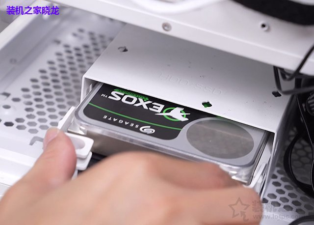
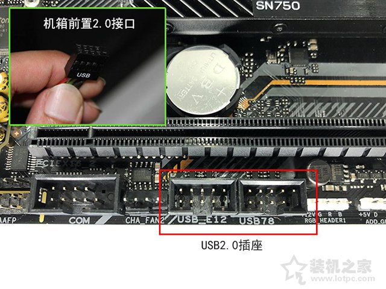
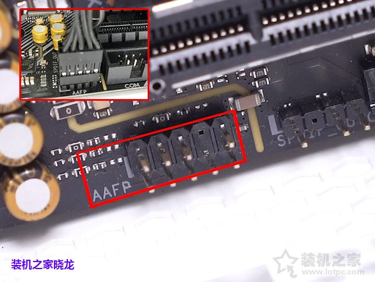
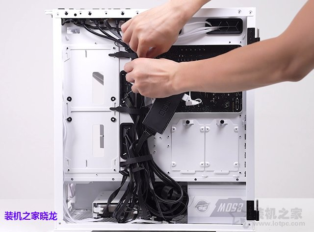

### **CPU（intel平台）**

1、首先我们取出电脑主板，将CPU插槽右边的金属拉杆向下压，并向外拉即可解锁。

2、打开CPU插槽的盖子或者拉杆至垂直，如下图所示。

3、将intel CPU取出来，安装CPU请注意方向，CPU左下方会有一个“三角图标”，需要对应主板上标注的“三角”或者“圆形”标识，并且CPU有防呆设计，在CPU的两边会半圆形的缺口，如果CPU安装反了是无法放不进去的。

4、主板上一般就会有三角形或者圆形的标注，这就是与CPU的“三角”图标对应的方向标识。此外在主板的CPU插槽中，也会有两边凸起的地方，主要和CPU两边会半圆形的缺口对应（防呆设计）。

4、CPU对准CPU插槽放入，确保CPU完全已经在CPU插槽中，这个时候我们可以看到CPU两边半圆形的防呆缺口已经对应主板插槽两边“小耳朵”，如下图所示。

5、确定CPU完全在CPU插槽中，我们将金属拉杆恢复至之前的位置上，完成安装。

6、这个时候，上面的小黑塑料盖子会自动弹出来，如果考虑后期卖主板，建议将主板包装盒与小黑塑料盖子保留。

7、如下图所示，已经成功将CPU安装到主板上了，安装CPU就是那么轻而易举，需要注意的就是CPU的安装方向不要搞错。

### 内存

1、安装电脑内存条的方法十分简单，首先我们将内存插槽两边的卡扣向外打开，有些主板是单边卡扣，一边打开就行了，如下图所示。

2、内存的金手指部分会有一个缺口，也是防呆设计，内存金手指防呆缺口与主板的“凸起横杠”防呆处对应插入即可，如果插反了是无法插进去的。

 

3、安装内存的时候需要注意的是，主板下面最好垫着一个包装盒，以免安装内存的时候，给主板背部带来伤害。可以双手大拇指用力压下内存，将内存完全插入主板内存插槽内，也可以先压下一边，再压下另一边，听到咔一声，基本安装完毕了。如何确定内存是否完全插入内存插槽中，可以从侧面观察一下内存金手指是不是完全在内存插槽中。

4、内存金手指部分完全插到内存插槽中，说明内存已经安装完成。如果有两根内存，另一根内存使用相同的方法，插入即可。双内存，建议组建双通道内存，距离CPU最近的内存插槽顺序开始编号，分别为1、2、3、4插槽，将内存分别插入1、3内存插槽或者2、4内存插槽。从优先级建议优先2和4内存插槽，其次1和3内存插槽，其实2和4插槽优先级最大的好处就是躲开塔式CPU散热器，如果你的水冷散热器不影响内存插槽，也可以考虑1、3插槽。

**内存正确插法如下：**

1根内存的情况下，插入在第#2插槽，单通道内存，因为组建双通道内存，必须2根内存或者以上数量才可以。

2根内存的情况下，优先插入在第2和第4插槽，其次1和3插槽，完成组建双通道内存。

3根内存的情况下，插入在第2和第4插槽，而第三根任意，建议插入到3插槽，避免塔式CPU散热器挡住，完成组建双通道内存。

4根内存的情况下，插满就对了，完成组建双通道内存。

### **M.2固态硬盘**

这款主板上一共有三个M.2插槽，建议优先插到靠近CPU的M.2插槽，有些主板第二M.2插槽是半速的，不同型号自己可以看下主板说明书。我准备安装的这块M.2固态是支持PCIe4.0的，当然这块主板也是支持PCIe4.0的。

1、如果主板上带有M.2散热片请拆卸下来，在主板盒子中找到M.2固态硬盘的螺丝和铜螺柱，先取出来，我们将M.2固态硬盘的铜螺柱拧到第三个孔位中，也就是主板上标注的“2280”规格的位置上，因为目前的绝大多数M.2固态硬盘都是2280主流规格。由于我这款主板的铜螺柱默认就是安装好的，螺丝也在铜螺柱上，将螺丝拧下来，准备安装M.2固态。

2、将M.2固态硬盘金手指部分插入主板上M.2插槽中，再将M.2固态硬盘放下去。

3、使用M.2固态硬盘的螺丝将这款M.2固态尾部进行固定，螺丝拧紧之后，M.2固态硬盘就成功安装完毕啦。

注：由于我这款M.2 SSD固态硬盘自带了散热片，所以主板自带的散热片就不需要安装了。如果M.2固态硬盘不自带散热马甲，主板默认配备了散热片可以安装上去，需要注意的是一般主板自带的M.2散热片底部可能会有一层膜，需要撕掉哦。

### **CPU散热器**

CPU散热器以及所有的配件、螺丝、硅脂等从散热器包装盒中取出来，等待安装。

2、将主板反过来，从主板的背面安装，将CPU散热器的背板扣具四颗螺丝对应主板的四个孔位穿过去。如果无法对齐四个孔位，可以向外或者向内自由调节背板扣具。

3、让CPU散热器的背板扣具完全贴合主板。

4、从主板的正面我们就可以看到CPU散热器的背板扣具的四颗螺丝已经冒出来了。

5、拧上固定背板使用的四个六边形螺丝，先用手拧，然后使用散热器内附送的套筒进行拧紧，如下图所示。

6、撕下CPU散热器底部的一层保护膜，如下图所示。

7、将CPU散热器上的风扇取下来，用手抠风扇卡扣处并往外扣，有点费手哦，用点劲。

8、将长条扣具固定在散热塔底座上，使用CPU散热器附送的螺丝固定，安装方法如下图所示。

9、安装之后的效果图。

10、另一边的长条扣具安装方法相同，如下图所示。

11、我们取出硅脂，将硅脂的袋子撕了。

12、将硅脂涂抹在CPU中间，散热硅脂不要过多，过多可能会溢出。

13、你可以像我这样，中间一小坨就可以了，到时候CPU散热器压下来会扩散。当然你也可以使用硅脂画一个十字架，或者花好几个点点，至于怎么样，你开心就好。硅脂的作用其实就是填充CPU散热器底座与CPU之间的空隙。

14、我们将CPU散热器主体拿起来，将四个弹簧螺丝对准之前固定的四个六边形螺丝上，如下图所示。

15、使用螺丝刀固定，记得先不要将一处弹簧螺丝固定的太紧，先拧一半，然后再固定对角的弹簧螺丝，也先拧一半，再拧上第三弹簧螺丝，拧一半，拧上第四弹簧螺丝，所有的弹簧螺丝都拧一半了，最后将所有弹簧螺丝完全拧紧，不要问我为什么，这是心得，你自己试试就知道了。

16、再将散热器上的风扇安装回去，先扣住一边，再上另一边，如下图所示。

17、这时候CPU散热器的风扇已经安装回去了。

18、开始插CPU散热器风扇供电线了，但是由于CPU散热器风扇线有点长，所以插之前，为了好看整洁，我们都会将线缠绕，如下图所示。当然我是一个有讲究的人，如果你不在意这些，可以忽视。

19、在CPU散热器附近找到主板上标注“CPU_FAN”的英文，这个CPU_FAN插口就是插CPU风冷散热器风扇的供电接口，插上去就可以了。旁边还有一个CPU_OPT插口，属于水冷泵专用接口的。

### 主板

主板主体拿到手上，准备安装固定在机箱内，安装主板主体的时候，先需要安装I/O挡板，不过我们这款主板的I/O挡板已经固定在主板上，不需要单独安装了。

PS：为了照顾独立I/O挡板的用户，我们还是教一下独立的I/O挡板的安装方法吧。

将I/O挡板用手推进去，可能需要用点力气，切记I/O挡板一定要完整推进去，需要注意的是，I/O挡板不要安装倒了，可以对比一下主板上的接口，以保证主板上的接口可以对应上。

I/O挡板完整推进去之后，我们可以从外面看到I/O挡板上好多小圆点卡扣，说明已经安装完成了。

3、根据主板上的固定孔位，安装铜螺柱，如下图所示。有些机箱默认就是安装好铜螺柱，如果遇到个别铜螺柱位置与您的主板孔位不同，可以将铜螺柱拧下来，重新安装。铜螺柱安装可以直接手拧，但是比较费手，建议使用套筒工具。

4、将主板多个孔位对应铜螺柱位置，如下图所示。

5、固定主板的螺丝一般是这种戴帽子的小螺丝，如下图所示。

6、所有的螺丝拧上之后，主板就被固定在机箱内部了。

7、我们将一体式水冷散热器冷排托在机箱内部的顶面，并对应孔位上螺丝固定在机箱上。当然一体式水冷散热器冷排也可以安装在机箱内部的前面，最关键的是机箱需要支持360规格水冷排的安装。

### wifi

主板wifi安装方法。

### **机箱风扇**

机箱风扇，我们将风扇安装在机箱背部，这个地方是机箱风扇的黄金位置，靠近CPU，散热效果也是最好的，切记是出风，不是进风，将热量直接排出机箱外。从机箱外面拧上对应的螺丝即可，这个风扇螺丝一般是购买风扇附送的，一般是又粗又长的那种。

2、如果有多个风扇，可以安装在机箱前部，机箱一般是前进风，后出风，良好的风道有效利于散热。风扇安装在机箱前部的时候，需要拆卸掉机箱前面板进行安装，拆卸机箱前面板也十分简单，大多数的机箱手拉前面板下部就可以拆卸下来了，当然也有的机箱前面板有螺丝固定，需要将螺丝拧下来进行拆卸，风扇安装好之后安装机箱前面板即可。

3、风扇是固定在机箱上了，但是还是需要供电的，否则风扇怎么转呢，对吧。机箱风扇供电线需要接到主板上“CHA_FAN”或者“SYS_FAN”插座上。如果机箱风扇少一针，也是可以兼容的。注：风扇四针接口代表支持PWM温控调速，三针不支持PWM温控调速。

当然机箱风扇太多，我们也可以将机箱风扇连接到风扇集线器上，包括一体式水冷散热器冷排上的风扇都插到风扇集线器上，风扇集线器主线插到CPU_FAN插座上即可，当然集线器也需要供电的，一般为sata供电线，在电源上找到sata供电线插上即可。

风扇集线器使用方法：

如果您的机箱风扇是大4P接口，找到电源上的大4P接口对应插上即可。

D型供电接口的机箱风扇，如果多风扇的情况下，还可以串联连接起来，如下图所示。

**机箱安装风扇最佳位置如下：**

1个风扇的时候，安装机箱后方出风风扇效果最佳，尤其是CPU温度，降低最为明显。

2个风扇的时候，安装1个后方出风风扇和1个前方进风风扇，降温最明显，达到了不错的散热效果，前吸冷风后排热风。

3个风扇的时候，安装1个后方出风风扇和2个前方进风风扇，降温效果最佳。

4个风扇的时候，安装1个后方出风风扇和2个前方进风风扇以及1个上方出风风扇，相比3个风扇（前2后1）的时候降温幅度已经很小了。

5个风扇的时候，就是在机箱底部增加了一个风扇，对CPU温度几乎没有影响，但是能够稍微降低了显卡的温度，只有1-2度。

**机箱风扇装几个合适？**

如果您需要安装风扇的情况下，一般1-3个风扇降温效果最佳，风扇再多的话，降温幅度就非常小了，并且在噪音上会有明显增加，尤其是夜深人静的时候。

**我安装的风扇很多，机箱上没有那么多风扇供电插口（例如CHA_FAN）怎么办？**

可以购买一个风扇集线器就可以解决了。

### 电源

安装在机箱右侧板下方的电源仓位中，电源的安装方向是电源风扇往下，将电源推到电源仓位中。

对应上孔位，找到机箱附送的螺丝，找到最大带帽子的螺丝，将四颗螺丝全部拧紧即可，电源安装完毕，如下图所示。

### **机械硬盘**

**（与SATA固态硬盘接线相同）**

由于机箱采用的是硬盘托架安装方式，首先我们从机箱中取出硬盘托架，将硬盘固定在硬盘托架上。

2、有些硬盘托架是需要上螺丝固定的，有些硬盘托架免螺丝的，根据你机箱设计实际情况而定。

3、在电源上找到SATA供电接口（L型）插上，这是给硬盘提供供电的，SATA供电接口如下图左侧的接口。再从主板包装盒中找到SATA数据线，连接到硬盘上，SATA数据线是如下图右侧的接口。如下图所示，机械硬盘的线已经连接成功，SATA固态硬盘由于接口相同，所以完全可以参考。

注：将“SATA数据线”和“SATA供电接口”分别插到机械硬盘对应的插口上，有防呆设计，不用担心插错；

4、将安装完成的机械硬盘托架推至硬盘仓位中即可。

5、将机械硬盘连接的SATA数据线接口另一头的插到主板上的SATA插座上即可，机械硬盘安装成功了。

**主板上那么多SATA插座，到底接到哪个上面？**

一般，SATA插座都是按序号排的，例如SATA6G_0、SATA6G_1、SATA6G_2、SATA6G_3、SATA6G_4等，理论上安装到哪个上都可以，但是SATA接口位置不同存在优先级问题，数字越小，优先级越高。举个例子，你有一个SATA固态硬盘和一个SATA机械硬盘，那么SATA固态硬盘优先级无疑要高于SATA机械硬盘，这样的话，电脑开机默认硬盘是SATA固态硬盘，而不是机械硬盘。如果机械硬盘优先级高于固态硬盘的话，那么开机默认硬盘就是机械硬盘，那么操作系统都是存放在固态硬盘，会导致无法正常进入操作系统了。当然，我们可以在主板BIOS中设置启动顺序，可以解决这个问题

### **机箱跳线与主板的接法**

1、如果您的机箱前置支持USB3.0接口，那么我们需要找到机箱上的USB3.0线，如下图所示。

2、我们在主板上找到USB3.0插座，直接插上即可，USB3.0也是有防呆设计的，反了肯定无法插进去。

3、由于我这款机箱前置面板仅支持USB3.0接口，为了防止广大网友遇到USB2.0接口不知道怎么接，特地做了一个USB2.0图解教程，找到机箱前置USB2.0接口，插入主板上标注USB的插座上即可。

4、一般标注了“HD_AUDIO”之类的英文标识的接口就是机箱前置音频接口，看起来类似USB2.0接口，但是两者防呆设计不同，不能互接。

5、HD_AUDIO前置音频接口如何接，我们在主板上找到AAFP、AUDIO等英文标识的插座，就是前置音频插座，我们直接插上去就可以了，这时候你的机箱前面板的音频接口才可以使用。

6、对于初次装机的朋友，跳线接法应该是最难的地方，但是只要你学会了之后，肯定觉得这是最轻松最简单的装机步骤了。跳线接口分别是POWER SW、RESET SW、POWER LED、HDD LED，我们先来学习一下它们分别代表什么意思。

HDD LED：硬盘指示灯；

Power LED：电源指示灯；

RESET SW：机箱重启按键；

POWER SW：机箱开关机按键；

7、其实在主板上已经标注了这些跳线接法了，我们只需要按照主板上的提示逐个插入即可。装机之家晓龙为了更好的方便大家理解，制作了一张POWER SW、RESET SW、POWER LED、HDD LED的主板跳线安装示意图，找到主板跳线位置，我们分别对应插入即可，主板跳线接法图解如下图所示。

9、灯效插针

主板上的灯效接口，3针的接口为5V的供电，不能正反双插，3针带来的光效可以通过编程让不同的灯组显示不同的颜色变幻，而4针的接口为12V供电，4针带来的光效是让LED灯都显示相同的光效，不支持正反双插，4针RGB灯针要注意正负极。两者不能相互通用，每个插针上会有电压标识，大家可以根据自己的风扇实际规格来选择，如果出现风扇过多的情况，可以使用集线器来进行连接。

**步骤十：电脑组装教程之电源为主板和CPU提供供电**

1、主板也是需要供电的，我们找到电源上的24pin供电接口，并找到主板上的24PIN供电插座，插入电源上的24pin供电接口即可，如下图所示。

3、我们在找到电源上的CPU供电接口，通常在供电接口上都标注了CPU的字样，如下图所示。

4、CPU供电插座一般在CPU插槽旁边，每个主板的供电接口不同，有些是单4PIN供电插座，有些是单8PIN供电插座，有些是8+4PIN供电插座等。如下图所示，我们演示的主板为8+4PIN供电插座，全部插上即可。注：如果你的主板比较入门，只有4PIN插座，那么插上4PIN的CPU供电接口，另外多余的4PIN闲置即可，一般电源上的8PIN的CPU供电接口是可以一分为二的，也就是4+4PIN。

5、如果有集线器或者机箱自带的集线器，千万不要忘记插上供电，一般集线器供电为SATA供电，我们在电源上找到SATA供电线插上即可。

### **独立显卡**

1、没有独立显卡请跳过此步骤，首先我们需要将独立显卡位置的挡板拆卸下来，使用十字螺丝刀拧下螺丝，挡板就可以卸下来了。有些机箱可能设计上有出入，挡板可能不是螺丝固定的，需要用手回来扳掉，比较费手一些。

2、我的这款显卡需要拆卸掉两块挡板。

3、在主板上找到PCI-E X16显卡插槽，我这款主板上一共有三个显卡插槽，如果有多显卡插槽的情况下，建议优先考虑安装在最靠近CPU插槽的那显卡插槽中。

4、显卡金手指部分对准主板上的PCI-E X16显卡插槽完全插入，可以从侧面观察一下，将显卡金手指部分完全在显卡插槽中说明已经安装成功了。

5、在显卡尾部挡板的孔位拧上螺丝，将独立显卡固定在机箱上，螺丝是电源那种螺丝就可以了，带帽子的大螺丝。

6、如果显卡需要外接供电，我们需要找到电源上连接的PCI-E显卡供电接口，如下图所示。

7、该显卡属于双8PIN供电，分别插上8PIN供电接口即可，当然8PIN供电接口也是可以进行拆分的，例如6PIN、8PIN、6+8PIN等，显卡需要几PIN供电，我们就需要插上几PIN即可，此时独立显卡安装完毕了。当然有些入门级显卡或者功耗较低的显卡是无需外接供电的，所以还是需要结合自己显卡实际情况而定。

### 理线

机箱背部线材可以用扎带捆绑，由于是装机演示，背部理线我们是随便搞搞了，有强迫症的朋友，当然你也可以花费点时间研究一下如何走线理线更加清爽好看，当然机箱背板一安装什么线都看不见。

最后安装机箱两边侧板，电脑组装教程结束

### 总结·

1. 线有防呆设计,会有多余的口.
2. 机箱前板是卡壳的设计,需要用大力掰开.
3. CPU Fan Error错误,  散热器的电源接针要连接到CPU_Fan的接口上.

