### **所需工具**

**1.原版的Windows下载（使用迅雷软件下载）**

**系统版本：Windows 10 专业版/家庭版  64位（推荐）**

SHA1：5cc6e158a9d90b9c474ace8a55b66f88bd16221d

文件大小：4.88GB（ISO文件）

**下载地址：**[点击下载](ed2k://|file|cn_windows_10_multi-edition_version_1709_updated_dec_2017_x64_dvd_100406696.iso|5242322944|7D89E63B0C4B5881DBCDB042FF1EB8F3|/) （可以鼠标右击复制下载地址）

支持B560主板的Win10系统下载：[Win10](http://www.baiyunxitong.com/soft/windows/5485.html)镜像下载（Win10 21H1专业版）

**2.驱动工具**

软件名称：驱动精灵 万能网卡版

**3.激活工具**

自行网上下载，下载对应您的系统版本的系统

**4、U盘一个**

8G容量或者以上容量的U盘

**5、下载UltraISO软碟通软件**

软件名称：UltraISO

**6、或使用老毛桃UEFI winpe,u盘启动盘,拷贝ISO文件**

### **将原版系统写入U盘**

1，鼠标右键点击UltraISO可执行文件，弹出菜单之后选择“以管理员身份运行”，如下图所示：

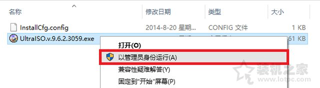

2、在打开UltraISO软件之后，我们依次点击左上角的“文件”按钮，弹出菜单之后点击“打开”，如下图所示：

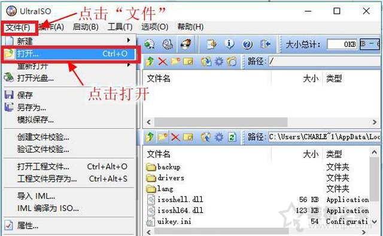

3、我们浏览到下载的Windows安装映像文件目录，找到刚刚下载原版系统，点击该文件并点击“打开”按钮，如下图所示：

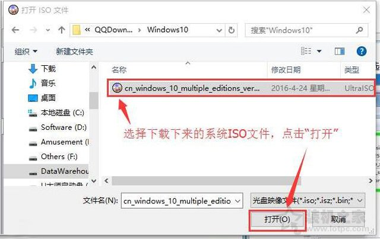

4、回到UltraISO软件主界面，再依次点击菜单栏中的“启动”按钮，弹出菜单之后点击“写入硬盘镜像...”，如下图所示：

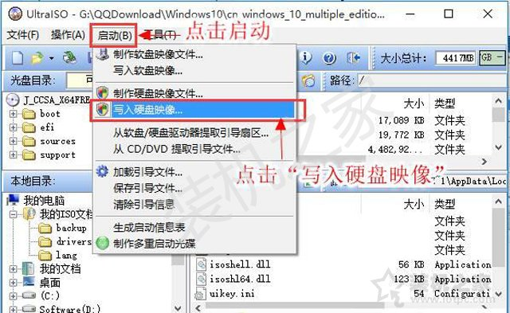

5、在弹出“写入硬盘映像”窗口中，我们将写入方式修改为“USB-HDD+”，隐藏启动分区为“无”，直接点击“写入”按钮，如下图所示：

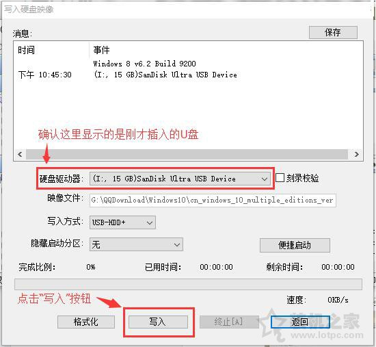

6、这时UltraISO软件会将系统映像文件写入至U盘中，

### BIOS设置

**华硕B560主板装Win10***系统BIOS设置步骤

1、电脑重新开机或重启的过程中，也就是在出现华硕品牌Logo的时候，连续按Esc或F8进入BIOS设置，将BIOS改成简体中文；

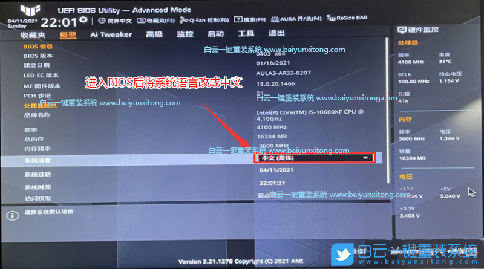

2、按→方向键，移动到高级选项，找到PACH存储设置，将SATA 模式选择，由RAID改成AHCI硬盘模式，这样可以避免PE中找不到硬盘的情况；

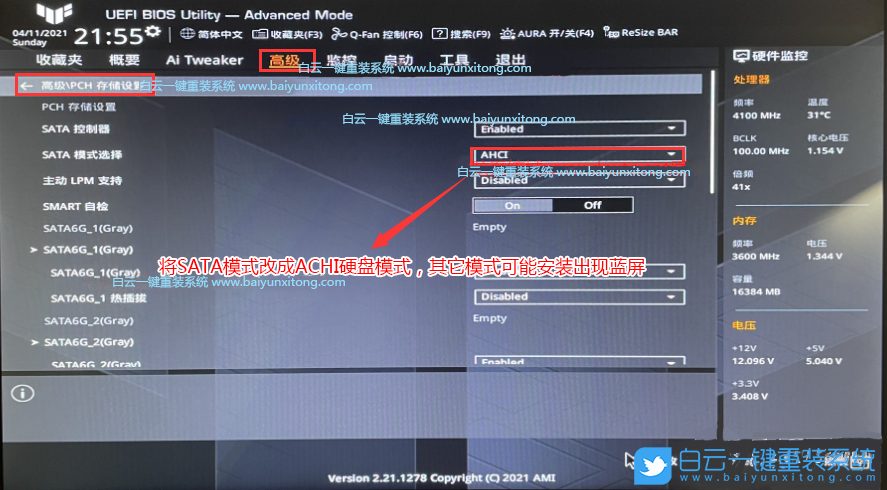

3、按→方向键，移动到启动选项，选择安全启动菜单，然后回车进入，将安全启动模式改成标准，再将操作系统类型改成其他操作系统；

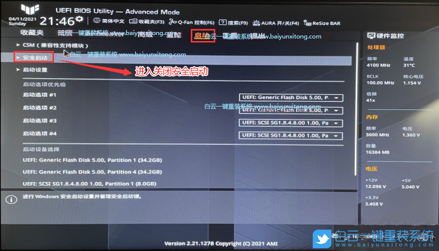

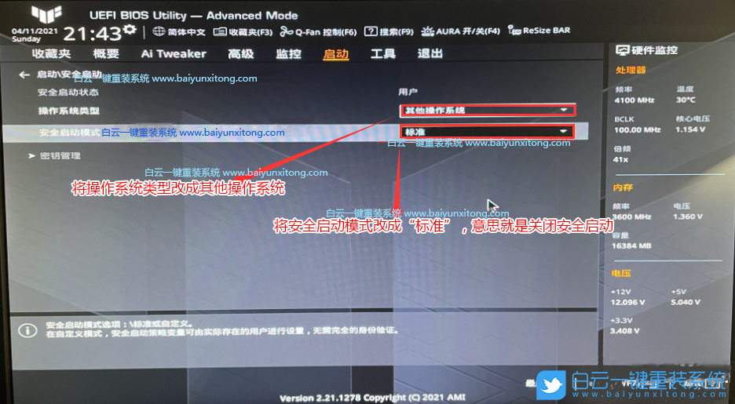

4、接着把Boot Option #1选项改为普通引导，设置第一启动项为普通硬盘引导，UEFI+GPT模式，要选择带Windwos Boot Manager的为UEFI引导分区，然后按F10保存设置；

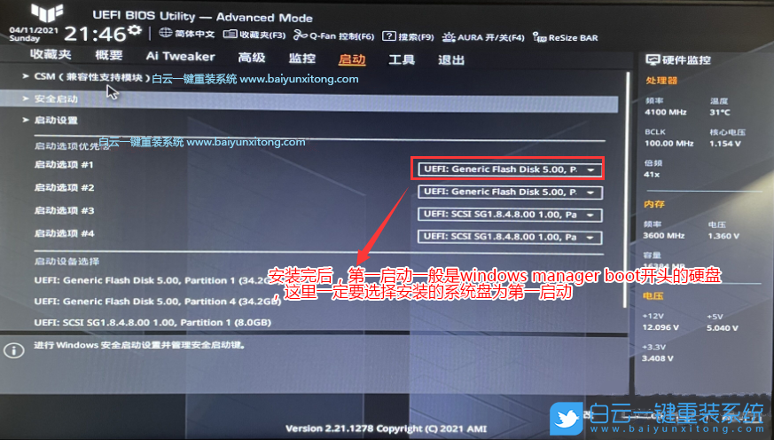

5、往电脑插入已经制作好的U盘启动盘，重启的时候连续按ESC选择识别到的U盘启动项，并回车选择即可；

### **安装系统**

需要将电脑重新启动，在电脑启动之后连续点按键盘上启动快捷键，由于不同品牌的主板、笔记本、品牌机的启动快捷键有所不同，可以对照以下对应的启动快捷键。

**启动快捷键大全对照表：**

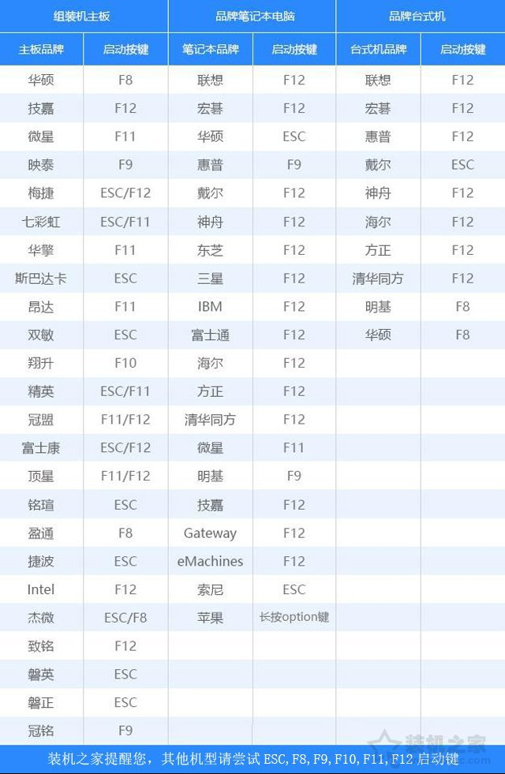

1、我们以Win10系统为例，Win7系统方法大同小异。启动U盘之后，我们进入了Windows系统安装界面，选择语言和时间、输入法等，直接下一步，

### 总结

1. 计算机的设备管理中, 网卡设备有黄色的惊叹号·. win10系统版本太低,网卡驱动不兼容.  Win10 21H1
2. 电脑的设备管理中出现多个“PCI简易通讯控制器”,SM总线控制器设备，且旁边有黄色的惊叹号

