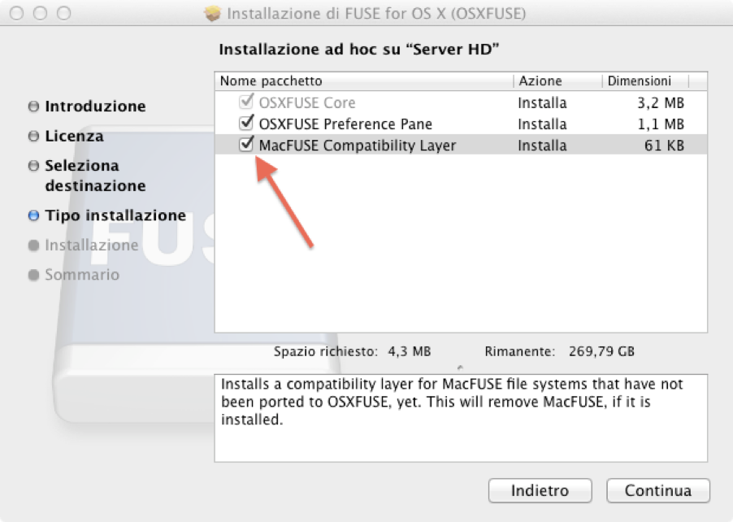
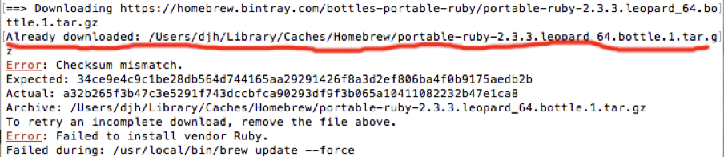

安装方法

1. 首先关闭[SIP机制](https://www.freebuf.com/articles/system/97411.html)

2. 安装 FUSE for Mac [官方网站](https://osxfuse.github.io/)

3. 使用 Homebrew 安装 [ntfs-3g](https://github.com/osxfuse/osxfuse/wiki/NTFS-3G)

   - 在安装FUSE后，使用Homebrew安装ntfs文件系统的支持，执行如下命令：
   - brew install ntfs-3g

4. 更换MacOS的NTFS默认挂载程序

   - 首先备份系统默认的NTFS挂载程序

   - - - sudo mv /sbin/mount_ntfs /sbin/mount_ntfs.orig
       - 出错：mv: rename /sbin/mount_ntfs to /sbin/mount_ntfs.orig: Read-only file system
       - 执行：sudo mount -uw /

   - 然后将ntfs-3g挂载程序链接到/sbin/mount_ntfs

   - - - sudo ln -s /usr/local/sbin/mount_ntfs /sbin/mount_ntfs

   - 如果在执行上述命令时，有如下错误mv: rename mount_ntfs to mount_ntfs_orig: Operation not permitted.

   - - - 重启Mac并进入恢复模式(Recovery)：

       - - 重启电脑时不停的按快捷键command+R

       - 使用终端.app关闭安全限制SIR(系统完整性保护)：

       - - 进入恢复模式后在顶部找到实用工具下的终端.app并打开，打开后在终端中输入以下命令：
         - csrutil disable

5. 重新启动

6. 执行：

   - diskutil list #查询设备名
   - sudo mkdir /Volumes/NTFS. #创建挂载目录
   - diskutil unmountDisk force /dev/disk2 #执行硬盘卸载命令
   - sudo /usr/local/bin/ntfs-3g /dev/disk2s1 /Volumes/NTFS -olocal -oallow_other -o auto_xattr  或  sudo mount -t ntfs -o rw,auto /dev/disk2s1 /Volumes/NTFS  

7. 开机挂载脚本，磁盘设备名和密码请自行替换，并将脚本加入到开机启动项

8. 若不成功，重新安装，然后执行：

   - sudo /usr/local/bin/ntfs-3g /My Passport /Volumes/NTFS -olocal -oallow_other

   - - - 错误1：

       - - dyld: Library not loaded: /usr/local/lib/libfuse.2.dylib 
         - Referenced from: /usr/local/bin/ntfs-3g
         - Reason: image not found

       - 解决方案：

       - - During the installation of OSXFUSE, you need to enable MacFuse Compatibility Layer by flagging the appropriate checkbox as shown below:

           

         - Once you’re done with this, replug your ext2/3 formatted drive and it’ll automagically mount it in Finder, giving your deserved magnificent user experience of a Mac user 

       - 错误2:

       - - 改为: sudo /usr/local/bin/ntfs-3g /dev/disk2 /Volumes/NTFS -olocal -oallow_other

         - 读取硬盘出问题，只看到文件夹，无文件。

         - - 命令中添加 -o auto_xattr。

         - 执行后错误

         - - Error opening '/dev/disk2': Resource busy
           - Failed to mount '/dev/disk2': Resource busy
           - Mount is denied because the NTFS volume is already exclusively opened.

         - 已打开硬盘，执行卸载命令 diskutil unmountDisk force /dev/disk2

       - 错误3:

       - - NTFS signature is missing.

         - Failed to mount '/dev/disk2': Invalid argument

         - The device '/dev/disk2' doesn't seem to have a valid NTFS.

         - ```bash
           you are trying to mount the whole disk.
           You need to specify the partition:
           http://forum.ntfs-3g.org/viewtopic.php?t=590
           Code: /dev/diskxsxs
           where x is an integer value
           ```

   - - - - 改为：sudo /usr/local/bin/ntfs-3g /dev/disk2s1 /Volumes/NTFS -olocal -oallow_other

9. 重装 ntfs-3g 的错误

   Error: Checksum mismatch. 类似校验不匹配的错误报错信息时，可以使用下面的解决方法：

   

   如图所示，出现这种报错信息时，直接使用控制台命令，删除已经下载的文件(红线处)。

   执行： rm -rf /Users/djh/Library/Caches/Homebrew/portable-ruby-2.3.3.leopard_64.bottle.1.tar.gz

   然后重新安装即可。

- - 若是ntfs-3g安装可能会在您的终端中提供以下错误：

  - - Error: Could not symlink sbin/ntfs-3g
    - usr/local/sbin is not writable.

  - 解决方案：

  - - 首先在终端中用命令创建所需要的目录：sudo mkdir sbin
    - 使用以下命令在sbin目录中启用写权限：sudo chown -R $(whoami) $(brew --prefix) 
    - 然后使用此命令链接ntfs-3g：brew link ntfs-3g

- 重换硬盘

- - 错误：

    Failed to write lock '/dev/disk2s1': Resource temporarily unavailable

    Error opening '/dev/disk2s1': Resource temporarily unavailable

    Failed to mount '/dev/disk2s1': Resource temporarily unavailable

    - diskutil list
    - 更换硬盘编号

- 参考：

https://my.oschina.net/songguangqi/blog/3101760

https://blog.csdn.net/w670328683/article/details/79310552