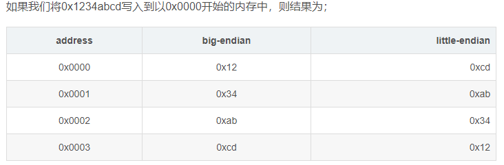

### 定义

shell：可执行程序，常用的有bash shell。通过它来操作Linux内核。

命令：内部命令（shell自带的命令）和外部命令（用户安装的）。可通过type命令来看。

命令帮助：内部命令用 help 查看，外部命令用man。

makewhatis命令创建whatis数据库：， 然后whatis和man -f 命令可用，否则提示nothing appropriate

命令详解可参考[Linux命令大全](https://man.linuxde.net/)

### 执行流程

1. 用户和密码进入bash shell。
2. 根据空格来切割字符串，把第一个位置认为是命令，其他的位置认为是命令的参数。
3. 判断命令式内部的还是外部，使用type命令
4. 若为外部命令，会在环境变量Path中查找，寻找这个命令的可执行文件的位置。
5. 并用hash缓存, 记录查询过的命令, 优化查询时间.  hash 查看. hash -r 清空
6. 再执行操作Linux内核。

### 常用命令

- 系统命令

  df :  显示磁盘分区使用情况.   -h  大小的单位.

  du : 文件系统使用情况.    -h  大小的单位.

  cls/clear    —清屏

  exit    —退出

  type   —查看命令类型。buildin.内部。

  file     —查看当前目录下的文件类型。etl二进制可执行文件。

  where/whereis notepad.exe   —查看命令路径：

  echo   —输出。如 echo $PATH. 输出环境变量。（区分大小写）。

  service network restart  —重启网络服务

  ifconfig    —查看网卡配置信息。

  ping  网址   —-测试网络连接。

- 用户和权限

  增加用户和组：useradd，userdel，passwd，groupadd。

  用户和组关联：usermod -G groupname username；id username 查询。

  修改文件的用户和组：chown root:share share/  share文件夹的用户为 root，组为share。不变为空

  修改文件的权限 r w x：chmod u; chmod g+w share/；chmod o-rx share/;

  使用数字模式：chmod 765 share/.    r w x 111. 二进制计算。chmod 777 dir -R

  删除用户的相关文件：rm -rf /home/username；rm -rf /var/spool/main/username;

  sudo  普通用户操作root权限的文件。

  su 切换用户。

- 目录和文件的操作

  find：用不同的搜索标准如名字、类型、所属人、大小等来搜索目录树。

  ```
  find -name test.file  //搜索整个目录树
  find /var -name test.file   //搜索指定文件夹
  ```

  locate：是一种比find更快的方式，因为它在数据库中查找文件。

  - 安装：yum install mlocate
  - 更新搜索数据库：updatedb
  - 查找文件：locate test.file

  ls : 列出目录内容. ll, ls -l.

  

  ​	白色：表示普通文件 

  ​	蓝色：表示目录/文件夹 

  ​	绿色：表示可执行文件 

  ​	红色：表示压缩文件 

  ​	浅蓝色：链接文件 主要是使用ln命令建立的文件 

  ​	红色闪烁：表示链接的文件有问题 

  ​	黄色：表示设备文件 

  ​	灰色：表示其他文件

  d:     —输入盘符切换

  dir     —directory列出目录内容，dir是原来dos的命令

  cd     —相对-绝对路径 ：在当前工作路径下，切换目录或切换到绝对路径。change directory

  - cd ..  —返回当前工作路径的上层路径
  - cd \  — 回到当前的根目录
  - cd enter ~家目录， 回到当前用户root的家目录。
  - cd ~  进入用户家目录，比如root用户就进入到/root，比如zzz用户，就进入到/home/zzz

  pwd :  输出当前路径。

  mkdir : 创建目录.  mkdir -p ./a/b/c；mkdir a/{1,2,3}dir。 -p 接连创建目录，上级目录可以不存在

  rm: 删除.   rm -f.  rm -rf 目录/强制删

  cp : 拷贝文件,目录.    -r目录  cp /etc/(profile.inittab) ./  ;    cp -r ./a  ./new  ;  cp -l cp -s;

  mv : 移动.  mv profile ./a.  移动到a文件夹下。  mv profile profilebak   修改名字

  In : 链接.  默认硬链接(与当前链接一样指向同一文件).  -s 软链接(指向当前链接).

  stat:  查看文件的详细信息和状态.  Charge: 元数据改变.(内容,位置,权限,创建时间)

  touch: 修改文件时间属性为当前系统时间. 一致时间为当前时间. 创建新文本..

- 文件查看，查找分析

  cat     —连接并打印当前目录下的可执行文件（命令）的内容。cat file1 file2;  (内容不能多于一页)

  more  —分页显示.   space换页.  enter下一行.    (回退需要滑轮).

  less    —分页显示.   space换页,  enter下一行.   b 回退,  q t 存于内存. (不能查看大文件)

  head  —默认返回文件内容的开始10行  -5 开始5行

  tail   —默认返回文件内容的最后10行  -5 最后5行 ；-f 监控文件变化，输出文件的增量变化. 另一进程进行修改文件。

  echo "123" >>profile   将123写入profile文件.

  管道：可以接收管道左边的输出流。

  - cat testfile.txt | head -5;    查看文件内容的前5行内容
  - head -5 testfile.txt | tail -1   查看文件的第5行内容。

  xargs.： 若命令无法以输入流的方式接收管道左边的输出流，echo "/" | ls -l.  打印根目录。

  grep ： 打印符合正则表达式的行。查找文件或文件中的内容。

  - -E，扩展正则表达式字符。 否则像{ }等需要加转义\字符。
  - <>，单词首尾边界。
  - 只含3个数字 grep -E "([^0-9][0-9]|^[0-9])[0-9]([0-9][^0-9]|[0-9]$)" testfile
  - /n 反向引用。 grep -E "(hi.*)|(hello.*)\1.*\2" testfile

  cut: 分割文本中每行内容并打印。 cat testfile | cut -d ' ' -f1-3 -s

  - -d分割符  -f选择显示列  -s不显示没有分割符的行。

  sort：排序文本中每行内容并打印。

  - -n按值排序(否则按字典排序）-r倒序  -t分隔字符，-k选择排序的列    -u合并相同行   -f忽略大小写

  wc :  查看文件内容行数，字符数，单词数。cat passwd | wc -l；查看共有多少用户。

  sed options command file：行编辑器。对数据行进行新增，替换，删除，选取等操作。默认不修改源文件。

  - Options
    - -n 静默模式，不显示模式空间(内存)的内容。
    - -i 直接修改源文件。  -r 使用扩展正则表达式。
    - -e 同时执行多个脚本。 -f 选择脚本文件。
    - n或--quiet或—silent：仅显示script处理后的结果
  - Command
    - d删除行；p显示符合行；\n换行。  sed  -i "2,$d" ctest,，sed -i "2p" ctest.
    - a指定行后新增行，内容为string；i 行前新增。c取代。 sed -i "ainsert" ctest.
    - s查找和替换.    r忽略大小写， 默认替换第一个被匹配到的内容。g行内全局替换，第N处匹配开始替换时，可以使用 /Ng：
    - sed -i "s/\(IPADDR=\([0-9]\?[0-9][0-9]\?\.\)\{3\}\).*/\1110/" ifcfg-eth0
    - 正则表达式 \w\+ 匹配每一个单词，使用 [&] 替换它，& 对应于之前所匹配到的单词：echo this is a test line | sed 's/\w\+/[&]/g'
    - 如果test被匹配，则移动到匹配行的下一行，替换这一行的aa，变为bb，并打印该行，然后继续：sed '/test/{ n; s/aa/bb/; }' file

  awk 文本数据分析，逐行读入，以分隔符（制表符，空格）将每行切片，再进行分析。

  - awk 'BEGIN{ commands } pattern{ commands } END{ commands }'
  - awk -F ':' 'BEGIN {print "name,shell"}{print $1 "." $7} END {print "end"}' passwd
  - awk -F ':' '{print NR "\t" NF "\t" $0 }' passwd   行号，分隔列数，整行内容。
  - awk -f 脚本文件 file

- vi文本编辑器：

  - vi filename —新建或编辑。 +5  光标定位在5行。+ 定位在最后一行。
  - 编辑模式：按键具有编辑文本功能。默认进入。
    - 移动光标
      - 字符：h 左；j下；k上；l右。
      - 单词：w移至下一个单词的词首。e跳至当前或下一个单词的词尾。b跳至当前或前一个单词的词首。
      - 行内：0绝对行首，^行首的第一个非空白字符，$绝对行尾。
      - 行间：G文章末尾，3G第三行，gg文章开头。n<Enter>光标向下移动n行。
      - 翻屏：ctrl：f ，b。
    - 删除和替换字符：x 删除光标位置字符，3x 删除光标开始的3个字符。r 替换光标位置字符
    - 删除行：dd 删除游标所在的那一整行(, dw删除单词；ndd删除光标所在的向下 n 行。 dG 删除光标所在到最后一行的所有数据  d$.删除行内光标后的内容。
    - 复制粘贴&剪切：yw复制单词，yy复制整行，0,$y复制所有行；p当前光标后粘贴，P当前光标前粘贴
    - u撤销，ctrl+r恢复；**.** 点是重复上一步操作。
  - 输入模式：i,a,A,o,O 进入 esc退出。 按键本身意义
    - i：在当前光标所在的字符前面。
    - a：在当前光标所在的字符后面。
    - o：在当前光标所在的行的下一行
    - O：在当前光标所在的行的上一行
    - A：在当前光标所在的行的行尾
  - 末行模式：shift+: 进入。接受用户命令输入
    - ! :暂时离开 vi 到指令行模式下执行 command 的显示结果.
    - 设置
      - 显示行号 set nu/number,
      - 隐藏  set nonu/number
      - 设置文件只读  set readonly
    - 查找并替换。 %全文，$末尾行，+n偏移n行。
      - 查找：/after  向下查找    n 下一个，N上一个。?before  向上查找。
      - :s/word1/word2/gi   /：边界字符，也可用#@。  g：一行内全部替换；i：忽略大小写；
      - : . ,+3s/word1/word2/gi   当前行及下三行。.点表示当前光标行，
      - :n1,n2s/word1/word2/g    n1 与 n2 为数字。在第 n1 与 n2 行之间寻找 word1 这个字符串，并将该字符串取代为 word2
      - :%s/word1/word2/gc或:1,$s/word1/word2/g：全文寻找 word1 字符串，并将该字符串取代为 word2
      - 添加注释。 **:起始行号,结束行号s/^/注释符/g**（注意冒号）。
      - 取消注释： **:起始行号,结束行号s/^注释符//g**（注意冒号）
    - 删除：
      - 全删除： 0,$d,；
      - 删除1-3行：1，3d；删除倒数第二行： $-1d    只保留最后一行：1,$-1d
    - 保存，但不退出vi              :w
    - 保存并退出vi                 :wq  或者shift zz。
    - 强制退出vi，但不保存更改      :q!
    - 用其他文件名保存             :w filename
    - 在现有文件中保存并覆盖该文件   :w! filename


### (.)点的用法

1. 它放在目录名称的命令的参数处时，表示“当前目录“；两个点，表示“当前目录的父目录”
2. 在一个文件或目录的开头加上点，它表示这个文件或目录会被隐藏
3. 两个点，构建序列：echo {1..10..2} 得到1-10间的奇数；mkdir {2009..2019}*Invoices，touch file*{a..z}.txt
4. 可以是 source 命令的代名词，你可以用它在当前 shell 中执行一个文件，而不是以某种其它的方式去运行一个脚本文件（这通常指的是 Bash 会产生一个新的 shell 去运行它）如：. myscript; echo $myvar.