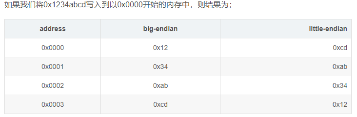

### 概念

数，是一个抽象的概念，是人类用来表示数量的一个智力产物。

位值制记数法：是指按位值制来计数的方法，即一个数的大小，用一组有顺序的数字来表示，每个数字所表示的大小，既取决于它本身的数值；又取决于它所在的位置。

计算机为啥用二进制：计算机的基层部件是由集成电路组成的，集成电路通电时，于是每个输出端就有了电压，电压的高低通过模数转换即转换成了二进制：高电平是由1表示，低电平由0表示。

二进制，十进制，十六进制，八进制的共同点：基数。radix。

八进制：C语言中，加“0”做前缀。如047。

十六进制：从C语言衍生的都用前缀“0x”表示。如0xAF

### 进制转换

转十进制的计算规则：位值*基数*位次幂(从0开始)，再相加。

十进制转其它的计算规则：除基数取余法。（或者熟记2的10次幂之内的结果，然后判断，如114=64+32+16+2）

二进制转八进制：整数部份从最低有效位开始，以3位一组，最高有效位不足3位时以0补齐。小数部分从最高有效位开始，不足补0.

（11001111.01111）2 = （011 001 111.011 110）2 = （317.36）8

八进制转二进制：每一位八进制数改写成等值的3位2进制数，次序不变。

（17.36）8 = （001 111 .011 110）2 = （1111.01111）2

十六进制转二进制：每一位十六进制数改写成等值的4位2进制数，次序不变。

（1CA）16 = （111001010）2

### 二进制0和二进制负数

正整数的反码和原码为什么相同：

1. 在计算机中，只用补码表示负数，正数用原码表示。
2. 补码和反码被设计出来就是为了表示负数的。

为什么负数使用补码表示：

1. 这样就实现正数加负数的运算，减法可以当作加法运算。（CPU没有减法器）
2. 0的表述实现统一。0的原码和补码都是00000000
   1. 若用原码表示：0的表述为0000 0000和1000 0000.
   2. 用补码表示：0的反码为 1111 1111，补码再加1，进位1 0000 0000，最高第九位，但是计算为8位，所以第九位砍掉，称为溢出。补码为：0000 0000.
   3. 5+（-3）=0000 0101+ 1111 1101= 1 0000 0010=1溢出=0000 0010. =2.

-128的二进制补码是怎么得来的：

1. 补码10000000唯一的表示-128是一个规定
2. -128的原码 10000000 (-128，进位被舍去)
3. -128的反码 11111111
4. -128的补码  加1后，10000000，因为计算时，当进到第8位的时候,就表示溢出了,会被舍弃，叫溢出。

详细说明：

1. 原码、反码和补码是计算机中对数字二进制的三种表示方法，**表示带符号的数**（最高位，1代表负数，0代表正数）。原码：带符号整数，反码：对它的原码（除符号位外）各位取反，补码：对它的原码（除符号位外）各位取反后加1。
2. 无符号的正整数（含0），可以表达0-255，即 2^8=256，一共256种状态，从全0到全1的各种排列组合。
3. 带符号的数，因此其绝对值最大范围为0-127，即2^7=128，一共正负各128种状态，如果不采用特殊处理，这时候0占用2个编码（10000000和00000000），数据表示范围为-127到-0及+0到127，这样总体上一个字节只有255种状态，0浪费一个状态。
4. 原码+反码：8位**原码和反码**能够表示数的范围是-127~127，255个。
5. 补码：在补码中用(-128)代替了(-0)，所以补码的表示范围为：(-128~0~127)共256个

十进制负数转二进制：先求对应正数，然后符号位改为1，其余位取反加1.

-17=00010001=10010001=11101110=11101111.

二进制负数转十进制：符号位不变，余位取反加1.

### 二进制数间的逻辑运算

7种位运算 bitwise：

1. & 与:  遇0则0

2. | 或：遇1则1

3. ! 非：1-0，0-1

4. ^ 异或：相同为0，相异为1.（不进位加法）。

5. > > 右移：补符号位。（当前符号位为1补1，为0补0)，首位。

6. <<左移：补0. 末尾

7. > > > 无符号右移：补0. 首位。

移位运算与乘除运算的关系：

- 二进制正整数：左移一位，结果是将该数乘以2，右移一位除以2.
- 例：2的3次方：2<<2。
- 例：a=3,b=4. 交换位置。
  - a=a+b;  b=a-b; a=a-b.
  - a=a^b;  b=a^b;  a=a^b. （找出二进制数之间的不相同位数，然后各自取反）。
  - 第一次：a为差异值，它找到了原来a和b的二进制数不相同的位数，1为不相同，0为相同
  - 第二次：左边的a,如果位数为0，表示原值a和b的这个位数是一样的,那么b的这个位数就不需要改；如果位数为1，表示不相同，b的这个位数需要取反。
  - 第三次：同第二步。

x & (x-1)。其作用是将x的二进制表示中右边第一个1置0。

- 例用O(1)时间检测整数n是否是2的幂次。
  - 普通解法：循环除以2 ,是否能除尽得1。while x%2==0   x=x/2;
  - N如果是2的幂次，则N满足两个条件。1.N>0；2.N的二进制表示中只有一个1。
  - 使用x & (x-1)消去1，结果为0，则是2的次幂。
- 例：计算在一个 32 位的整数的二进制表示中有多少个 1.。
- 例：将整数A转换为B，需要改变多少个bit位。（异或后，计算1的个数。）

a^b^b=a。 数组中，只有一个数出现一次，剩下都出现三次，找出出现一次的。

https://blog.csdn.net/deaidai/article/details/78167367

### 长整数和短整数的转换：

短整数转长整数：为正数时，补0，负数补1.

0110 1101（8）=  0000 0000 0110 1101（16）

1100 0110（8）=  1111 1111 1100 0110（16）

长整数转短整数：前面多的砍掉。精度丢失。

0000 0101 0111 1101（16）=0111 1101（8）

### 数据单位：

1. bit：位，信息量的度量单位，为信息量的最小单位。
2. byte：字节 8bits。CPU寻址的最小数据项，最小的存储单元。
3. KB，MB，GB，TB   1024递增。

### LITTLE ENDIAN/BIG ENDIAN

各种计算机体系结构中，对于字节、字等的存储机制有所不同，因而引发了计算机通信领域中一个很重要的问题，即通信双方交流的信息单元（比特、字节、字、双字等等）应该以什么样的顺序进行传送。如果不达成一致的规则，通信双方将无法进行正确的编/译码从而导致通信失败。

字节序：超过一个字节的数在内存中的存储顺序。

字节序列的存储格式：

1. 将低序字节存储在起始地址（低位编址）：little endian
2. 将高序字节存储在起始地址（高位编址）：big endian.
3. CPU：PowerPC系列采用big endian方式存储数据，而x86系列则采用little endian方式存储数据。

